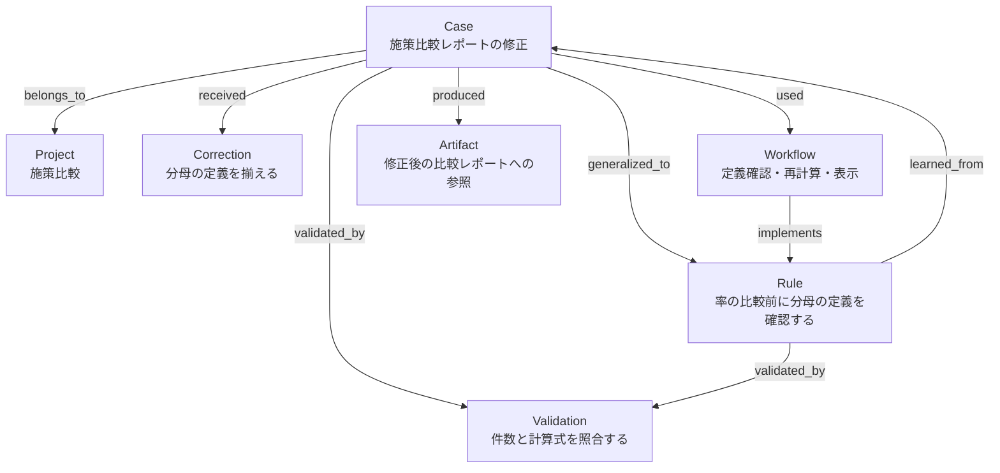
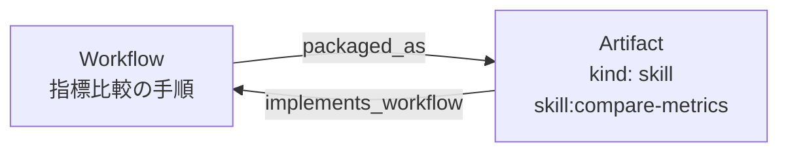

# Basic Memory Workgraphで構築されるナレッジグラフ

[概要](README.md) · [使い方と設定](usage.md) · [保存方針・仕組み](reference.md) · [docs一覧](../README.md)

Workgraphでは、作業から得たルール、手順、検証方法や修正指示をMarkdownノートに残し、根拠になった事例や成果物との関係を記録します。
次の仕事では、ノートとリンク先から「どの条件で使えるか」「何を確認して得た知識か」を確かめて再利用します。

このページの事例・ノート名・数値は、構造を説明するための架空の例です。実際に保存された個人Memoryではありません。

## ノートが知識の単位、リンクが知識同士の関係になる

グラフでは、知識を表すノートがノード、ノート同士の関係が向きのある辺に当たります。
Basic MemoryはMarkdownを保存・解析し、知識の検索や関連ノートの参照を扱います。
Workgraphは、そこへ残すノートの種類・形式・保存基準を定めます。

ノートには、種類を示すfrontmatter、条件や根拠を記すObservations、他のノートとの関係を書くRelationsがあります。
例えば、RuleからCaseへ`learned_from`で結べば、そのルールを得た具体的な出来事を辿れます。
RuleからValidationへ`validated_by`で結べば、そのルールについて何をどう確認するかが分かります。
矢印の向きは、関係を書いたノートからリンク先のノートへ向かいます。

### 7種類のノート

| 種類 | 保存する内容 | 配置先 | 例 |
|---|---|---|---|
| Case | 要求、出力、修正、改善、結果の具体的な経緯 | `cases/` | 施策比較レポートで分母の定義を修正した事例 |
| Correction | ユーザーの修正指示、望ましい出力、適用する文脈 | `corrections/` | 意思決定者向け資料では比較表と推奨案を先に置く |
| Rule | 条件付きのルール、明示された継続的な好み | `rules/` | 率を比較する前に分母の定義を確認する |
| Workflow | 再利用できる手順と、使う条件・例外 | `workflows/` | 指標の定義確認、再計算、比較結果の表示 |
| Validation | 確認する性質と、その確認方法 | `validations/` | 元の件数と計算式を照合する |
| Artifact | 成果物や登録済みSkillへの参照 | `artifacts/` | 修正後の比較レポートの参照先 |
| Project | 長期的に扱う案件や仕事の範囲 | `projects/` | 施策比較という仕事のスコープ |

`schemas/Rule.md`などのスキーマはノート構造の定義で、`rules/`などに保存する知識ノートとは役割が異なります。
`Work Knowledge Graph`の索引は種類や関係の案内です。導入しただけで、具体的な事例ノートが一式作られることはありません。

Basic Memoryの「プロジェクト」はノートを保存する先です。表のProjectノートは、その保存先の中で案件や仕事の範囲を表す知識ノートです。

## 例1 比較レポートで分母の定義を揃える

施策AとBのクリック率を比較したところ、Aは表示数、Bは訪問者数を分母にしていたとします。
ユーザーが定義の違いを指摘し、両方を表示数で計算し直した、という例です。

| 施策 | 元の比較 | 定義を揃えた比較 |
|---|---|---|
| A | クリック40件 ÷ 表示1,000回 = 4% | クリック40件 ÷ 表示1,000回 = 4% |
| B | クリック30件 ÷ 訪問者150人 = 20% | クリック30件 ÷ 表示1,000回 = 3% |

揃えるのは分母の定義です。施策ごとの表示数が異なっていても、同じ定義の指標として比較できます。
この例では、再計算と分母の定義の対応を確認したものとします。ユーザーが修正後の資料を承認したかどうかは不明です。

### 保存されたノート同士の関係

以下は、ユーザーの明示依頼によって、関係する7種類のノートが個別に保存された状態を示しています。
通常の作業で必ず全種類を作るという意味ではありません。自動保存の範囲は[後述の設定](#保存される範囲は設定と保存価値で決まる)に従います。



| 関係 | この例で表すこと |
|---|---|
| `Case → belongs_to → Project` | この事例が属する案件・仕事の範囲 |
| `Case → received → Correction` | この事例で受けた修正指示 |
| `Case → generalized_to → Rule` | この事例から取り出した条件付きルール |
| `Rule → learned_from → Case` | ルールの根拠になった事例 |
| `Case → used → Workflow` | この事例で使った手順 |
| `Workflow → implements → Rule` | ルールを実行するための手順 |
| `Case / Rule → validated_by → Validation` | 事例で使った確認方法、またはルールを確認する方法 |
| `Case → produced → Artifact` | この事例で作った成果物への参照 |

`generalized_to`と`learned_from`は、それぞれのノートに記録する関係です。
ルールを自動で生成したり、逆向きの関係を自動で追加したりする命令ではありません。
CaseとRuleの自動保存では、それぞれ独立に保存価値を判断し、両方が存在するときに関連付けます。
「分母を確認する」という一般論だけでは、抽象Memoryの自動保存に必要な追加価値の根拠にはなりません。

構造化Caseでは、出力・修正・検証の順序を、ノート内の`## Interaction`にあるJSONに保持します。
各発言を別のノートにする必要はありません。Observationsには検索用の要約を置き、経緯を確認するときはInteractionを読みます。
形式は[CAPTURE.md](../../tools/basic-memory-workgraph/templates/CAPTURE.md)を参照してください。

### Markdownではどう記録するか

例えば、`rules/check-rate-denominators.md`というRuleノートは次のようになります。
リンク先も説明用の架空のノートです。実運用では、保存済みで意味のあるノートへリンクします。

```markdown
---
title: 率を比較する前に分母の定義を確認する
type: rule
schema: Rule
sharing_scope: private
training_use: excluded
privacy_review: pending
---

## Observations
- [trigger] 複数の施策の率を、同じ指標として比較するとき。
- [action] 分子・分母が何を数えているか確認する。定義が異なる場合は違いを明記し、同じ指標として比較するなら定義を揃えて再計算する。
- [reason] この例では、表示数と訪問者数を混ぜたことで、異なる定義の率を同じ指標として扱っていた。
- [check] 施策Bを元の件数から再計算し、表示数を分母にした値が3%になることを確認した。
- [transfer_use] 別案件の施策比較や、集計レポートのレビューで使う。
- [exception] 異なる指標の定義そのものを比較する分析では、定義を揃えず違いを明示する。

## Relations
- learned_from [[cases/align-click-rate-denominators]]
- validated_by [[validations/recalculate-click-rates]]
```

`type`と`schema`がノートの種類と参照するスキーマを示します。`[trigger]`や`[check]`が、適用条件や確認した内容です。
Relationsでは、`learned_from`などの関係名と`[[リンク先]]`を組み合わせます。
Artifactには成果物の種類や参照先を記録します。ノートを保存しても、成果物ファイル自体はMemoryへ自動で複製されません。

### 確認した性質と、ユーザーの承認を分ける

| 記録 | この例で分かること |
|---|---|
| `verification` | 再計算と分母の定義の対応を確認した |
| `acceptance` | 明示承認がないため`unknown` |
| `assessments` | 採用・再利用を示すユーザー行動がないため空 |

検証結果は、確認した計算や定義についての根拠です。テストの成功だけでユーザーの満足や採用を判断しません。
採用を示す行動が後から観測された場合は、対象の出力と、その行動から分かる範囲をCaseに記録します。
これらの区別は[採用エビデンスの設計](evidence-design.md)で説明しています。

### 次の案件でどう使うか

別案件でクリック率の比較を依頼されたら、Codexは関連するRuleを検索し、適用条件を確認します。
`learned_from`のCaseで分母を混同した経緯を読み、`validated_by`のValidationで照合方法を確認し、必要なら関連するWorkflowを手順として使います。

この経緯と確認方法を、次の初回出力を作る段階から参考にできます。
グラフのリンクは関連性を示しますが、今回にも当てはまるかは目的・条件・例外を比較して判断します。

## 例2 資料の構成に対する修正指示を残す

意思決定者向けの資料で各案の詳細説明を先に置いたところ、ユーザーが「比較表と推奨案を先にして、細かい説明は後ろに」と修正したとします。
この場合は、次のようなCorrectionを残せます。

| 項目 | 残す内容 |
|---|---|
| 文脈 | 選択肢を選ぶための、意思決定者向け資料 |
| 初回出力の問題 | 各案の詳細説明が比較表より先にあった |
| 修正指示・望ましい出力 | 比較表、推奨案、詳細説明の順にする |
| 適用範囲 | 今回の意思決定用資料。別案件の恒久的な好みは未確認 |
| 確認状態 | 指示は確認済み。修正後の効果は未検証、結果・明示承認は不明 |

Correctionの保存には、明示的な保存依頼、または`correction=scoped`による自動保存が必要です。
設定と選別条件は[文脈付き修正指示の保存](usage.md#correction-mode)を参照してください。

次に目的・読者・成果物が似た資料を作るときは、出力前にCorrectionを検索し、比較と推奨を先に置く構成の参考にします。
詳細な技術チュートリアルまで同じ構成にする指示や、「常に短い文章を好む」という継続的な好みは、この記録からは確定しません。
Correctionだけが保存される場合もあり、CaseやRuleへの関連付けは、それぞれが保存された場合に行います。

## 手順をSkillとして登録した場合

再利用できるWorkflowをレビューし、検証を経てSkillとして登録した場合は、登録済みSkillへの参照をArtifactに残せます。
次の図は、登録後に関係を記録した状態の例です。



Skillには実行手順や補助資源を置き、Workflowには背景・根拠・使う条件・Skill化の判断を残します。
`skill:compare-metrics`は登録済みSkillを指す形式の例です。この名前のSkillが導入されるという意味ではありません。
候補を検討しただけの段階では、登録済みSkillを示すArtifactは作りません。
既定の`skill=review`は判断までです。自動登録には`skill=auto`の設定と、レビュー・検証が必要です。
手順は[SKILL_REVIEW.md](../../tools/basic-memory-workgraph/templates/SKILL_REVIEW.md)にあります。

## 保存される範囲は設定と保存価値で決まる

新規導入時の既定値は次のとおりです。更新時は既存の設定を保持します。

| 設定 | 既定値 | 保存・登録への影響 |
|---|---|---|
| `auto` | `smart` | 候補がある実装モードのターンで保存価値を評価する |
| `correction` | `off` | Correctionの保存には明示依頼が必要 |
| `case` | `off` | Caseの保存には明示依頼が必要 |
| `skill` | `review` | Skill化の判断まで。自動登録は行わない |

Rule・Workflow・Validationの自動保存には、元の案件以外での具体的な用途、有用性、実際の確認による根拠、適用条件と例外、既存Memoryにない追加価値が必要です。
作業完了や一般的なテスト成功だけでは保存の根拠になりません。明示された継続的な好みは、その指示と適用範囲を根拠に扱います。
Projectや成果物の参照を含むノート一式も、毎回自動で作るものではありません。

保存と再利用は、次の流れで行います。

1. 現在の依頼の目的・読者・成果物・制約を確認し、関連するCorrection・Rule・Workflow・Validation・Caseを検索する。
2. 作業から候補が得られたら、有効な保存モードと種類ごとの保存基準を確認する。
3. 同じ概念や事例を検索し、新しい根拠・条件・修正があれば既存ノートを更新する。新情報がなければ書き込まず、重複検索が失敗した場合は自動保存を見送る。
4. 保存するノートに条件・根拠・例外を残し、意味のある既存ノートと関連付ける。保存後に読み戻して内容と関係を確認する。
5. 次の依頼では検索結果だけで判断せず、該当ノートの根拠・反証・整合性を確認する。現在のユーザー指示を優先して使う。

追加hookは検索と保存評価をCodexに促します。内容の判断と保存はCodexが行い、すべての候補を捕捉する保証はありません。
Plan・読み取り専用モードでは参照だけを行い、ノートを書き込みません。
`auto=off`ではCorrection・Case・Skillレビューを含む自動処理が停止し、明示依頼は指定範囲で扱います。Skill登録CLIは、自動処理が有効で`skill=auto`の場合に使えます。

保存したノートは既定で`sharing_scope: private`、`training_use: excluded`です。
保存・検証・承認・採用推定・共有・学習利用はそれぞれ区別し、共有や学習用出力には別途指定と内容レビューが必要です。

保存基準の正本は[memory-policy.md](../../tools/basic-memory-workgraph/memory-policy.md)、種類と関係の規約は[Work Knowledge Graph](../../tools/basic-memory-workgraph/templates/Work-Knowledge-Graph.md)です。
設定変更は[使い方と設定](usage.md#modes)、内部構成は[リファレンス](reference.md)、記憶の点検は[トラブルシューティング](troubleshooting.md#audit)を参照してください。
