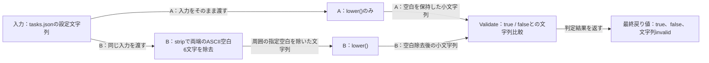
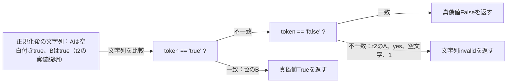
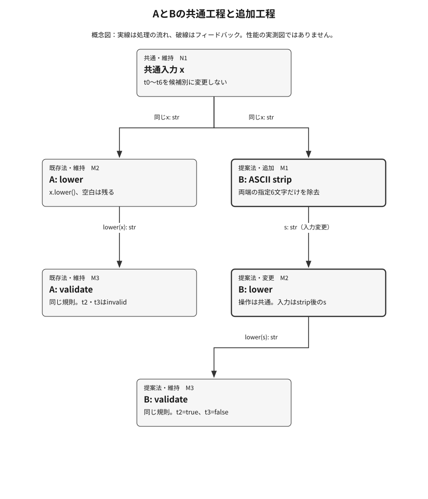

<!-- Generated by design-research compact-v1 -->
# 研究報告書

実行ID: 20261010T143105Z-6cc28cd0 / **research_complete** / 段階: reviewed / 反復: 1
更新: 2026-10-10T15:55:57.293710+00:00

## 要旨と現時点の結論

Required evidence, reporting and independent review complete; reporting status refreshed

課題: 要件に記載した2方式のみを比較し、実際のPython関数の最終出力を採点して、主要な結論を保存したあとに手法説明と独立レビューまで完了する。既存backendテストはないのでplan.test_commands=[]。生成される比較スクリプトはassets.experimentsにだけ宣言する。input_filesはPROJECT基準のtasks.json。要件外のファイル追加・network・インストールは不要。
対象版: Git管理なし

## 保存した工程と残る作業

| 工程 | 状態 | 必須 |
|---|---|---|
| 001-planner | complete | Yes |
| 001-producer-design | complete | Yes |
| 001-producer-assets | complete | Yes |
| 001-producer-results | complete | Yes |
| 001-evidence-A | complete | Yes |
| 001-evidence-B | complete | Yes |
| 001-producer-method | complete | Yes |
| 001-producer-reader | complete | Yes |
| 001-reviewer-dossier | complete | Yes |
| 001-review-R1 | complete | Yes |
| 001-review-R2 | complete | Yes |
| 001-review-R3 | complete | Yes |
| 001-review-R4 | complete | Yes |
| 001-report-current-conclusion | complete | Yes |

実測が保存されていても、必須の説明・独立レビューが未完了なら全体は完了していません。

提案: **ASCII-strip then lowercase parser**（provisional）
Conditionally recommend B for the supplied fixture: its measured 7/7 score exceeds A's 5/7 by 2/7, above the frozen 1/7 threshold, and corrects A's whitespace failures without fixture regressions. Measured conclusions were saved before detailed method explanation. Method explanation and independent evidence review are complete; saved R1–R4 checks all pass. The recommendation remains provisional because K4 declaration-placement and remaining execution-scope obligations are not fully established. No human acceptance is recorded, and no performance or broader-input superiority is inferred.

判断待ち・未確認: Verify K4 producer-assets declaration placement and remaining execution-scope requirements.
見直す条件: K4 declaration placement and remaining execution-scope requirements are established.; Additional representative inputs, including non-ASCII whitespace, change the scope or reveal regressions.

研究の完了は方式の採用承認を意味しません。

未解消: Critical 0件 / High 0件 / Medium 0件 / Low 0件

## 主要指標と具体的な差

研究の目的: effectiveness

対象入力: Reuse PROJECT-relative tasks.json: seven deterministic labeled boolean-configuration inputs. This explicitly narrow two-method comparison does not require additional candidates.
統制条件: Identical fixture inputs and expected outputs for A and B; Same Python runtime, permissions and budgets; One paired trial per task and candidate; all seven tasks retained; A lowercases and validates without stripping; B strips ASCII whitespace, lowercases and applies identical validation; Export actual Python return values as JSON booleans or the string invalid; never substitute expected labels for execution outputs; Preserve incorrect final outputs; execution errors and timeouts remain failures rather than successful measurements
予算・測定範囲: One parent-executed local standard-library experiment containing fourteen function invocations. No backend test invocation, network or installation. Authoring time, latency and memory are outside metric scope.
適用限界: Seven fixed deterministic tasks establish fixture-specific correctness only; no statistical, population-wide or performance inference. Inputs do not test non-ASCII whitespace.

異なる課題 7 件 / 対になる試行 7 組。繰り返しを別課題として数えません。

| 指標 | 候補 | 基準 | 候補の実測値 | 改善方向の差 | 事前の条件 | 判定 |
|---|---|---|---|---|---|---|
| accuracy (fraction) | B | 0.714286 | 1 | 0.285714 | 差 ≥ 0.14285714285714285 | 条件を満たす |

### 実行した具体例: t2

共通の入力:

```json
" true "
```

期待する最終結果:

```json
true
```

A の実際の最終結果（試行 1）:

```json
"invalid"
```

採点: {"accuracy": 0.0}

[実行して保存した結果](runs/20261010T143105Z-6cc28cd0/001-experiments/E1/artifacts/paired-results.json)

B の実際の最終結果（試行 1）:

```json
true
```

採点: {"accuracy": 1.0}

[実行して保存した結果](runs/20261010T143105Z-6cc28cd0/001-experiments/E1/artifacts/paired-results.json)


### 実行した具体例: t3

共通の入力:

```json
"\tfalse\n"
```

期待する最終結果:

```json
false
```

A の実際の最終結果（試行 1）:

```json
"invalid"
```

採点: {"accuracy": 0.0}

[実行して保存した結果](runs/20261010T143105Z-6cc28cd0/001-experiments/E1/artifacts/paired-results.json)

B の実際の最終結果（試行 1）:

```json
false
```

採点: {"accuracy": 1.0}

[実行して保存した結果](runs/20261010T143105Z-6cc28cd0/001-experiments/E1/artifacts/paired-results.json)

この入力集合と宣言した採点規則に限る結果です。統計的有意性や方式の普遍的な優位は示しません。

## はじめて読む方へ

### 何を解決するか

今回の7入力では、前後のASCII空白を除去するBが7/7正解、小文字化だけのAが5/7正解だった。差2/7は事前の推薦閾値1/7を上回るため、この入力集合にはBを条件付きで推薦する。設定文字列を真偽値へ変換する開発者が、空白による誤判定の原因と改善範囲を理解するための説明である。測定結論の保存後に手法説明を作成し、独立レビューまで完了した。保存済みR1〜R4はすべてpass。宣言配置を含むK4は未確認事項が残る。

対象・対象外：比較対象はAとBのみ。変更していないtasks.jsonの7入力について、同じ親実行内で各方式を1回ずつ呼び出した14個の実際の最終戻り値を、事前固定した期待値と型を含めて照合した。実測根拠はruns/20261010T143105Z-6cc28cd0/001-experiments/E1/artifacts/paired-results.jsonと同ディレクトリのreceipt.jsonであり、説明図や評価要約を測定の代用にしない。

現時点の要点：改善は空白付きの2入力に集中した。t2の入力" true "ではAが"invalid"、Bがtrueを返し、t3の入力"\tfalse\n"ではAが"invalid"、Bがfalseを返した。Aのこの2件は不正解として残す。他の5入力では両方式の出力が一致し、今回の集合でBの退行はなかった。これは7入力の完全一致率についての結論であり、一般的な精度や速度の優位を示すものではない。

### 具体的な利用例・入力から出力まで

課題は、有効なtrueまたはfalseの前後に空白があると、小文字化だけでは文字列が一致しないことにある。直感は、認識する語を増やさず、比較の前に周囲のASCII空白だけを取り除くことだ。図F1は入力から最終出力までの全体処理、図F2はF1のValidateを拡大して判定境界を示す。実測したt2を追うと、空白除去なしのAでは" true " → lower() → " true " → Validate → "invalid"となる。空白除去ありのBでは同じ入力がstrip(" \t\n\r\v\f") → "true" → lower() → "true" → Validate → trueとなり、固定期待値trueに一致する。ここで中間文字列は読んだ実装から説明したもので、中間状態を実測した記録ではない。実装はA(value)=validate(value.lower())、B(value)=validate(value.strip(" \t\n\r\v\f").lower())であり、共通のvalidateは文字列"true"にTrue、"false"にFalse、それ以外に文字列"invalid"を返す。t0の"true"とt1の"FALSE"は両方式とも正しい真偽値、t4の"yes"、t5の空文字、t6の"1"は両方式とも正しく"invalid"を返した。正解数を7で割る採点によりA=5/7、B=7/7、B−A=2/7となった。親のreceiptは終了コード0、タイムアウトなし、出力切詰めなしを記録している。本説明は既存結果を再利用し、再実行していない。

### 用語と前提

ASCII空白：Bのstripに明示された空白、タブ、改行、復帰、垂直タブ、改ページの6文字。strip：文字列の両端から指定文字を除去する処理で、内部の空白は除去しない。小文字化：lower()による処理で、今回の"FALSE"を"false"へ変換する。Validate：正規化後の文字列を"true"または"false"と比較する共通の判定部品。最終戻り値：Python関数が実際に返した値で、JSONではtrue、false、または文字列"invalid"として保存される。完全一致率：型と値の両方が固定期待値に一致した入力数を7で割った値。paired trial：同じ入力をAとBの両方へ渡す対応比較。

## 全体像から詳細へ

### 図1. 2方式の処理全体：同じ入力から型付き最終出力へ

実装の処理順を示す未測定の説明図。矢印は文字列または最終戻り値の受け渡しを表し、速度や正解率を表さない。



**図の読み方：** Inputから2本の経路を読む。Aは直接LowerAへ進み、BだけがStripBで周囲のASCII空白を除去する。両経路は同じ規則のValidateへ入り、真偽値または文字列invalidを返す。

図を表示できない場合：同じ設定文字列から、Aは小文字化、Bは両端のASCII空白除去と小文字化を行う。両方式とも共通のValidateで判定し、true、false、または文字列invalidを返す。

### 図2. Validateの拡大：受理する2語と拒否する入力

F1のValidateの条件分岐を拡大した未測定の説明図。矢印は判定条件と戻り値への分岐を表す。t2の実際の最終出力は別途保存された測定結果を参照する。



**図の読み方：** Tokenを最初に文字列trueと比較する。不一致なら文字列falseと比較し、両方に一致しなければ文字列invalidを返す。t2ではAのTokenは空白付きのため両比較に不一致、BのTokenはtrueに一致する。

図を表示できない場合：正規化後の文字列がtrueなら真偽値trueを返す。そうでなくfalseなら真偽値falseを返す。どちらでもなければ文字列invalidを返す。空白付きtrueは一致しない。

拡大元：F1 の Validate。

図と説明の適用範囲：測定は固定された7個の決定的入力、各方式各入力1回に限る。非ASCII空白、文字列内部の空白、文字列以外の型、より広い入力分布は試していない。指定するASCII空白6文字のうち、この集合に現れるのは空白・タブ・改行であり、復帰・垂直タブ・改ページは個別に検証されていない。統計的有意性、母集団全体での精度、処理時間、メモリ消費は示していない。receiptのduration_secondsは実験全体の記録であり、方式別の速度比較ではない。両方式のO(n)時間・O(n)一時文字列空間という記述も測定値ではない。結果のfailures=[]は実行例外がなかったことを表し、Aの2件の誤答がなかったことは意味しない。stderrには一時ディレクトリ内でPATH補助バイナリを作成できなかった警告が残っており、親実行は終了コード0で完了した。独立レビューは完了しR1〜R4はpassだが、生成スクリプトのassets.experimentsへの宣言配置と残るK4の実行範囲要件は未確認で、人による採用承認も記録されていない。図は未測定の説明用で、描画品質や読者理解を検証したものではない。

## 背景・課題と比較対象

対象: research
目的: Compare actual final Python boolean-parser outputs on the frozen fixture, save measured conclusions, then complete method explanation and independent review.
基準案: A: lowercase the input without stripping; return JSON true or false for recognized tokens, otherwise "invalid".

### 比較条件

Compare only A and B using PROJECT-relative tasks.json. Conclusions apply only to these seven deterministic inputs; performance, population accuracy and non-ASCII whitespace are outside scope.

- hard: Compare exactly A and B using Python standard-library functions; differ only by B's specified ASCII whitespace stripping before lowercasing and identical validation.
- hard: Read unchanged PROJECT-relative tasks.json; retain all seven task IDs, inputs and typed expected values under identical execution conditions.
- hard: Grade actual final return values using type-preserving whole-JSON exact matching; preserve incorrect outputs, execution errors and timeouts. Measurements require final artifacts and successful parent receipts.
- hard: One parent-executed experiment with fourteen function invocations; test_commands=[]; no network, installation or unrelated additions. Declare the generated comparison script only in producer-assets assets.experiments, with input_files=["tasks.json"].

### 候補の比較

| 方式 | 評価軸 | 結果 | 根拠の種類 |
|---|---|---|---|
| Lowercase-only parser | R1: Exact final-output accuracy | A matched 5/7 labels. It returned invalid incorrectly on t2 and t3; the saved paired difference B minus A is 2/7 (0.2857142857142857). | measured |
| Lowercase-only parser | R2: Fixture and comparison fidelity | Saved implementation, original fixture, final paired records and receipt support lowercase-only behavior, shared validation, frozen typed grading and full paired coverage. | reported |
| ASCII-strip then lowercase parser | R1: Exact final-output accuracy | B matches 7/7 final outputs (1.0), versus A's 5/7 (0.7142857142857143). The paired improvement is 2/7 (0.2857142857142857), correcting t2 and t3 with no regressions on the other five tasks; it exceeds the frozen 1/7 threshold. | measured |
| ASCII-strip then lowercase parser | R2: Fixture and comparison fidelity | Saved implementation, original fixture, final artifact and parent receipt support unchanged fixture use, complete paired coverage, actual typed returns and the specified sole normalization difference. K4 workflow obligations remain partly unknown. | reported |

## 提案手法

**説明対象：B — ASCII-strip then lowercase parser**

設計記述と図の構造チェック済み。新規性・有効性・比較上の優越を認定するものではありません。

S5の最終成果物はcomplete=true、実行例外failures=\[\]で、14件の戻り値とAのt2・t3の誤りを保持する。S6はexit\_code=0、timed\_out=false、truncated=false。B\_S7にはPATH aliases用helper binariesを一時ディレクトリに作れなかった警告が残る。accuracyはA=0.7142857142857143、B=1.0、差=0.2857142857142857。測定結論の保存後に手法説明を作成し、独立レビューも完了した。保存済みR1〜R4はすべてpass。K4はunknown、decisionはprovisionalのままである。遅延・メモリ・非ASCII空白・統計的有意性は未測定。図は説明定義であり、この単位では描画や視覚検査をしていない。

### ねらいと直感

Bは、周辺ASCII空白のため正しいboolean文字列を拒否するAの問題を、判定前の空白除去で修正する。受理語彙と出力型はAと同じである。保存済みE1は7件の範囲で5/7から7/7への改善を示す。

共有validateを変更せず、その前に指定ASCII周辺空白を除去すれば、t2・t3の誤出力を直し、残る5件の最終出力を維持できる。E1はこの固定fixture内の予測を支持する。

Aはlower後の文字列をそのままtrue・falseと比較するため、周辺空白が残ると一致しない。Bはvalue.strip\(' \\t\\n\\r\\v\\f'\).lower\(\)で周辺の指定6文字だけを除去してから同じvalidateへ渡す。これによりt2・t3は既存の受理トークンへ写り、yes・空文字・1は引き続きinvalidになる。出力型と判定語彙は変えず、内部空白や非ASCII空白は除去しない。効果の根拠はS5の実際の対応出力であり、処理図から効果を推定していない。

### 全体像と具体例

実測例t2: 入力は" true "。Aはlower後も周辺スペースが残りinvalidを返した。Bはstripで"true"にし、lower後の共有validateでPython True、JSON trueを返した。t3でもタブと改行の除去によりJSON falseを返した。t0=true、t1=false、t4・t5・t6=invalidは両方式で同じだった。中間文字列の説明は実装からの再構成で、中間値を別途測定した記録ではない。


**図1．Bの入力から最終値まで**　Bは指定ASCII空白除去を小文字化と共有validateの前に加える。処理概念図であり測定図ではない。

左から右へstrを受け渡す。addedのM1が介入点で、M2とM3の操作はAと共通。出力の実測根拠はS5である。

[図1の編集用定義](runs/20261010T143105Z-6cc28cd0/method-figures/bafa1004275724eecbbefc2ecebb281351f2531ae9e685fb4ee4cd57cd76570b/F1.json)

### 構成要素の詳細

#### M1：指定ASCII周辺空白除去

**入力：** x: Python str  
**出力：** s: Python str

value.strip\(' \\t\\n\\r\\v\\f'\)で指定集合に属する先頭・末尾の連続文字を除去する。内部文字は残す。

**なぜ必要か：** FM1のトークン不一致を、比較前に不要な周辺文字を除くことで解消する。

**既存法との差分：** Aにはない追加処理。入力型と後段validateは維持する。

**追加コスト：** 解析上時間O\(n\)、一時領域O\(n\)。定数係数と実使用量は未測定。

#### M2：小文字化

**入力：** Bではs、Aではx: Python str  
**出力：** t: Python str

str.lower\(\)を一回適用する。

**なぜ必要か：** 大文字FALSEを共有受理語falseへ変換する。

**既存法との差分：** 操作は同じ。Bでは入力がASCII strip後の文字列になる。

**追加コスト：** 解析上時間O\(n\)、一時領域O\(n\)。実測性能なし。

#### M3：共有トークン検証

**入力：** t: Python str  
**出力：** Python True、Falseまたは文字列invalid

t=='true'ならTrue、t=='false'ならFalse、それ以外ならinvalidを返す。

**なぜ必要か：** 正規化と受理語彙を分離し、yes・空文字・1の誤受理を防ぐ。

**既存法との差分：** AとBで同じvalidateを使う。

**追加コスト：** 固定2トークンとの比較。全体の時間・領域上界はO\(n\)。追加学習パラメータなし。


**図2．M1が除去する範囲**　ASCII6文字の先頭・末尾の連続部分だけを除去し、内部を保持する。

図は一回のstripの意味を分解した説明であり、二回のstrip呼出しを指示していない。空文字でも定義される。非ASCII空白を同じ集合へ追加しない。

[図2の編集用定義](runs/20261010T143105Z-6cc28cd0/method-figures/bafa1004275724eecbbefc2ecebb281351f2531ae9e685fb4ee4cd57cd76570b/F2.json)

### 記号・定式化とアルゴリズム

| 記号 | 意味 | 型・次元・範囲 |
|---|---|---|
| x | 元の入力文字列 | Python str、長さn&gt;=0 |
| W | 除去対象のASCII空白6文字 | 固定集合 \{U\+0020,U\+0009,U\+000A,U\+000D,U\+000B,U\+000C\} |
| s | strip\_W\(x\)の結果 | Python str、長さ0〜n |
| t | lower\(s\)の結果 | Python str |
| V | 共有validate関数 | str → boolまたは文字列invalid |

```math
xを入力str、Wをスペース・タブ・LF・CR・VT・FFの集合とする。s=strip_W(x)、t=lower(s)。V(t)はtがtrueならTrue、falseならFalse、その他なら文字列invalid。A(x)=V(lower(x))、B(x)=V(lower(strip_W(x)))。strip_Wは先頭と末尾のWの連続部分だけを除去し、内部文字を維持する。
```

strip\_Wは両端の指定空白だけを削り、lowerは文字の大小を正規化する。Vは正規化後の文字列を固定2語と比較して型付き値を返す。AとBの式の差はstrip\_Wだけであり、採点の正解値は式の入力に含まれない。

**擬似コード**

```text
1. parse_b(value: str)として入力を受ける。2. s=value.strip(' \t\n\r\v\f')を得る。3. t=s.lower()を得る。4. 共有validate(t)を呼び、t=='true'ならTrue、t=='false'ならFalse、それ以外なら文字列'invalid'を返す。5. 実験時のみ戻り値をJSONのbooleanまたは文字列として保存し、凍結正解と型および値が一致した場合だけ正解とする。例外を成功値に置き換えない。
```

### 学習・準備時と推論・実行時

**学習・準備時：** 学習・パラメータ推定・適応はない。ASCII6文字の集合、受理トークン、戻り値と7件の評価契約は固定済み。正解ラベルをparse\_bへ渡さず、戻り値取得後の採点にだけ使う。

**推論・実行時：** parse\_b\(value: str\)で周辺ASCII空白除去、lower、共有validateの順に処理する。出力はTrue、False、文字列invalidのいずれか。E1ではJSONへ保存した最終値を型付きで採点した。

### 既存法との差分とトレードオフ

| 観点 | 既存法 | 提案法 | 代償・成立条件 |
|---|---|---|---|
| 周辺ASCII空白 | 除去しないためt2・t3でinvalid | M1を追加しt2=true、t3=false | 空白を拒否する別仕様には適合しない。 |
| 大小文字・受理語彙・出力型 | lowerと共有validateでtrue・falseだけを受理 | 同じM2・M3を維持 | 語彙拡張や内部空白修復は行わない。 |
| 資源 | 解析上O\(n\)時間・一時領域 | 同じ漸近上界でstrip工程を追加 | 実際の遅延と割当量は未測定。 |



**図3．AとBの共通工程と追加工程**　Aはlowerから開始し、Bはその前にASCII stripを追加する。下流の検証は同じ。

baselineとproposalの2経路を並べて読む。addedはBのstrip、modifiedはlowerへ入る文字列、unchangedは同じ小文字化操作と検証規則を示す。Bのlowerの操作自体は変わらない。t2・t3の実際の出力差はS5を参照する。

[図3の編集用定義](runs/20261010T143105Z-6cc28cd0/method-figures/bafa1004275724eecbbefc2ecebb281351f2531ae9e685fb4ee4cd57cd76570b/F3.json)

### 先行研究からの導入と独自部分

起点はS1のboolean設定値要件、実装根拠はS7である。判定前の局所正規化を対象操作へ適用し、validateの受理語彙と出力型を保持する。周辺ASCII空白を許す前提に変更するため、厳密に空白を拒否したい用途とは非互換。最小実装はparse\_bのstrip追加だけで、他領域の研究成果を移植したという主張はしない。

最も近い既存実装はS7に保存されたparse\_bそのものであり、S1にも同じstrip後のlowerという操作が指定されている。今回の貢献はこの既存方式の形式化と実測結果に結び付く説明で、アルゴリズムの新規性ではない。独立した一次研究2件の調査はなく、文献新規性は未検証。

**新規性の記録：** overlaps\_prior\_art（自動認定ではありません）

- S1：Bound boolean-parser requirements。確認箇所：Entire requirements paragraph。出典の詳細は主張・根拠の台帳を参照。
- S2：Frozen evaluation contract。確認箇所：candidate\_ids, tasks, controls, metrics\[0\], limitations。出典の詳細は主張・根拠の台帳を参照。
- S5：Actual E1 paired final outputs。確認箇所：contract\_sha256, tasks, trials, complete, failures, accuracy, paired\_difference。出典の詳細は主張・根拠の台帳を参照。
- S6：Parent-owned E1 execution receipt。確認箇所：command, experiment\_id, source\_fingerprint, exit\_code, timed\_out, truncated, outputs, artifacts。出典の詳細は主張・根拠の台帳を参照。
- S7：Executed Python comparison implementation。確認箇所：CONTRACT\_SHA256, FROZEN\_TASKS, validate, parse\_a, parse\_b, main。出典の詳細は主張・根拠の台帳を参照。
- B\_S7：E1 original stderr。確認箇所：Entire warning line beginning WARNING: proceeding。出典の詳細は主張・根拠の台帳を参照。

### 実装への組込みと計算負担

保存済みS7のparse\_b\(value: str\)が統合点であり、parse\_aとvalidateは比較基準として維持する。Python標準のstr処理だけで追加依存や学習は不要。文字列入力とboolまたはinvalidの出力インターフェースは同じだが、周辺ASCII空白を持つ入力の受理挙動は意図的に変わる。要件外の本番コード変更はこの単位では行わない。

解析上、入力長nに対して両方式は時間O\(n\)、一時文字列領域O\(n\)。Bはstripの走査と中間文字列を追加する。定数係数、実際の割当量、遅延、メモリは未測定で、receiptの全体実行時間をパーサ性能とみなさない。

### なぜこの案を詳しく検討するか

唯一の指定提案Bは、共有validateを維持する小さい変更でAの実測誤出力2件を説明し、固定fixtureで2/7の改善を得たため詳述する。新規手法という位置付けではなく既存方式の形式化である。手法説明と独立レビューは完了し、保存済みR1〜R4はpass。K4未確認により最終推奨は条件付きのまま。

Bは唯一の指定非baseline候補で、説明対象として選ぶ。dossier.decision.candidate\_idもBで一致する。手法説明と独立レビューは完了したが、K4の確認事項が残るため条件付き判断を維持する。人による採用承認は記録されていない。

比較の目安は全5手法。現在の比較はベースライン1＋提案候補1。アブレーションを数合わせに使いません。

**比較数の例外理由：** 既定の全5方式に対し、要件と凍結済み評価契約はA・Bの2方式だけを明示的に指定している。介入はASCII空白除去の有無に固定され、入力・採点規則・実行予算も凍結済みである。追加候補は依頼範囲と比較条件を変えるため作らず、ベースラインAと実質的な提案Bの1案に限定する。

### 成立条件・反論と設計の改訂

**成立条件**

- 入力はstrで、周辺の指定ASCII空白を許容する要件である。
- 受理語彙は大小文字を無視したtrue・falseに限り、その他は文字列invalidとする。
- E1の固定7件と凍結ラベルだけを有効性の判断対象とする。

**主要な反論**

- 周辺空白付きの2件を含む小さいfixtureなので、改善を一般用途へ広げる根拠にはならない。
- 改善は標準文字列処理の追加で説明でき、新しいアルゴリズムを必要としない。
- 期待値や入力を候補別に変えれば差を作れるため、正規化の効果と評価混入を区別する必要がある。
- E1の成功だけではK4の宣言配置や全禁止事項の順守、独立レビューの完了を証明しない。独立レビューの完了は保存済みR1〜R4の判定と完了単位により確認する。

**反論を受けた改訂**

- 説明と結論を固定7件に限定し、一般性能と非ASCII空白は未測定と記した。
- 既存方式のrepairとして扱い、新規性を主張せずS7との同一性を明示した。
- 共有validate、凍結fixtureガード、型付き採点と14件の実際の対応出力を説明の根拠にした。
- 完了単位と保存済みR1〜R4のpassを反映し、手法説明と独立レビューの待機記述を更新した。K4=unknownとdecision=provisionalを保持した。

**失敗すると予想される条件：** 非ASCII空白の除去、内部空白の修正、yesや1の受理は対象外。str以外は例外になり得る。周辺空白を不正とする別仕様ではBの受理拡大が誤りになる。7件での7/7は一般入力の完全性を保証しない。

### 仮説と検証実験の対応

| 仮説 | 対象 | 実験 | 競合する説明 | 棄却・修正する条件 |
|---|---|---|---|---|
| M1がt2・t3の周辺ASCII空白を除くことで誤出力を直す。 | M1, M2, M3 | E1：executed | 入力や正解の差、別validateの使用が改善を作った可能性。共有validate、凍結入力ガードと対応記録で区別する。 | 実際のt2・t3でBが正しいbooleanを返さない、または実装差がstrip以外にも存在すれば機構説明を棄却または修正する。 |
| 追加正規化は残る5件の最終出力を維持し、固定7件で1/7以上改善する。 | M1, M2, M3 | E1：executed | 2件の改善と別入力の退行が相殺される、または型を無視した採点で見かけの成功になる。 | 残る5件に退行がある、型付き採点の差が1/7未満、または最終出力・receiptが欠ける場合は主張を修正する。 |

図はこの設計の説明用です。結果の主張は後続の実験記録と結び付け、未実験の利点は仮説として扱います。


## 実験設定・結果・根拠


### 主張と根拠

#### C1（reported）

The requirements specify exactly two parsers and final boolean or invalid-string outputs on a reused fixture.
条件: Bound requirements for this comparison
限界: Requirements describe desired behavior rather than measurements.

- [S1: Bound boolean-parser requirements](runs/20261010T143105Z-6cc28cd0/inputs/bound-requirements.md) / supports / Entire requirements paragraph
#### C2（reported）

The evaluation freezes seven paired tasks, mean typed exact-match accuracy and a recommendation threshold of at least one additional correct task for B.
条件: Frozen evaluation contract
限界: The threshold applies only to the supplied fixture.

- [S2: Frozen evaluation contract](runs/20261010T143105Z-6cc28cd0/001-producer-design-b7bc1b/inputs/evaluation_contract.json) / supports / candidate_ids, tasks, controls, metrics[0], limitations
#### C3（reported）

B must strip only the specified ASCII whitespace before lowercasing; backend test_commands is empty and measured conclusions precede method explanation and independent review.
条件: Saved plan
限界: The plan specifies the required sequence; completion is established separately by the completed required units and saved criterion reviews.

- [S3: Saved comparison plan](runs/20261010T143105Z-6cc28cd0/001-producer-design-b7bc1b/inputs/plan.json) / supports / constraints, criteria R2-R4, test_commands
#### C4（observed）

In E1, A matched 5/7 final outputs and B matched 7/7. B improved accuracy by 2/7, exceeding the frozen 1/7 acceptance delta.
条件: E1, fourteen actual function returns on t0-t6, graded by typed exact matching
限界: Seven fixed deterministic tasks only; no population, statistical significance or performance inference.

- [S5: Actual E1 paired final outputs](runs/20261010T143105Z-6cc28cd0/001-experiments/E1/artifacts/paired-results.json) / supports / trials, accuracy, paired_difference, complete, failures
- [S6: Parent-owned E1 execution receipt](runs/20261010T143105Z-6cc28cd0/001-experiments/E1/receipt.json) / supports / experiment_id, exit_code, timed_out, truncated, artifacts
- [S2: Frozen evaluation contract](runs/20261010T143105Z-6cc28cd0/001-producer-design-b7bc1b/inputs/evaluation_contract.json) / context / metrics[0].acceptance_delta and grading
#### C5（observed）

A incorrectly returned the string invalid for t2 and t3, whose expected outputs were true and false. B returned those expected booleans; both methods matched t0, t1, t4, t5 and t6.
条件: Saved E1 paired final returns
限界: Other whitespace inputs, including non-ASCII whitespace, were not evaluated.

- [S5: Actual E1 paired final outputs](runs/20261010T143105Z-6cc28cd0/001-experiments/E1/artifacts/paired-results.json) / supports / tasks and all fourteen trials
- [S6: Parent-owned E1 execution receipt](runs/20261010T143105Z-6cc28cd0/001-experiments/E1/receipt.json) / supports / artifacts[0]
#### C6（observed）

The saved code implements exactly A and B with a shared validator; B alone adds strip(' \t\n\r\v\f'). It checks the input fixture against frozen typed JSON, then invokes each function once per task and exports actual returns. The receipt fingerprints tasks.json consistently with the original snapshot, and final results retain all seven task records and fourteen returns.
条件: E1 implementation and saved execution evidence
限界: This inspection does not establish producer-assets declaration placement or independent review completion.

- [S7: Executed Python comparison implementation](runs/20261010T143105Z-6cc28cd0/001-experiments/E1/code/compare_parsers.py) / supports / validate, parse_a, parse_b, main fixture check and paired loop
- [S4: Original input fixture](runs/20261010T143105Z-6cc28cd0/source-inputs/d53daa9dda637faffb26a16493ce332ef4e82d51f0f684eec4a00752a9407100/tasks.json) / supports / All seven records t0-t6
- [S5: Actual E1 paired final outputs](runs/20261010T143105Z-6cc28cd0/001-experiments/E1/artifacts/paired-results.json) / supports / tasks and trials
- [S6: Parent-owned E1 execution receipt](runs/20261010T143105Z-6cc28cd0/001-experiments/E1/receipt.json) / supports / command and source_fingerprint.files.tasks.json
#### C7（observed）

The parent E1 receipt records exit code 0, no timeout and no truncation, with the final result artifact. The result reports complete=true and no execution exceptions. A's two incorrect outputs remain accuracy failures. Saved stderr contains a PATH-alias helper warning despite successful execution.
条件: Parent-owned E1 receipt and final result
限界: Receipt duration is process duration, not measured parser latency. The helper warning does not establish parser failure.

- [S6: Parent-owned E1 execution receipt](runs/20261010T143105Z-6cc28cd0/001-experiments/E1/receipt.json) / supports / exit_code, timed_out, truncated, outputs.stderr, artifacts
- [S5: Actual E1 paired final outputs](runs/20261010T143105Z-6cc28cd0/001-experiments/E1/artifacts/paired-results.json) / supports / complete, failures and A trials t2/t3
#### A_C1（reported）

The frozen evaluation names A as the baseline and grades seven actual typed final returns against fixed labels. Whitespace-surrounded true and false are expected to return booleans, although A's specified implementation does not strip whitespace.
条件: Frozen E1 contract, tasks t0-t6.
限界: The contract specifies scoring; it is not an execution measurement.

- [A_S1: Frozen evaluation contract](runs/20261010T143105Z-6cc28cd0/001-producer-evidence-47824e/inputs/evaluation_contract.json) / supports / baseline_id, tasks[t2,t3], controls, metrics[0].grading, limitations
#### A_C2（inferred）

The saved implementation faithfully implements A as validate(value.lower()). Both candidates share validation and run on every fixture record; B differs by ASCII whitespace stripping before lowercasing. The script reads the supplied fixture, rejects changes relative to FROZEN_TASKS and compares actual returns using both Python type identity and value equality.
条件: Static inspection of the saved E1 implementation, corroborated by final records and the receipt.
限界: This is source inspection, not a fresh execution or independent environment audit.

- [A_S4: Executed Python comparison implementation](runs/20261010T143105Z-6cc28cd0/001-experiments/E1/code/compare_parsers.py) / supports / validate, parse_a, parse_b; main: fixture canonical comparison, nested task/candidate loop, actual=function(task['input']), matched expression
- [A_S3: Original frozen input fixture](runs/20261010T143105Z-6cc28cd0/source-inputs/d53daa9dda637faffb26a16493ce332ef4e82d51f0f684eec4a00752a9407100/tasks.json) / supports / All seven records t0-t6
- [A_S5: Actual E1 paired final outputs](runs/20261010T143105Z-6cc28cd0/001-experiments/E1/artifacts/paired-results.json) / supports / tasks, trials: seven A records and seven B records
- [A_S6: Parent-owned E1 execution receipt](runs/20261010T143105Z-6cc28cd0/001-experiments/E1/receipt.json) / supports / command, source_fingerprint.files.tasks.json, artifacts
#### A_C3（observed）

In parent-executed E1, A returned true on t0, false on t1, and the string invalid on t2-t6. It matched five of seven frozen labels, with accuracy 0.7142857142857143. Its invalid returns on t2 and t3 were incorrect and remain in the artifact. The paired artifact reports B minus A as 0.2857142857142857, arising from those two tasks.
条件: E1; seven deterministic tasks, one trial per candidate/task, typed exact matching.
限界: Fixture-specific correctness only; no population, statistical, latency or memory conclusion.; Non-ASCII whitespace was not tested.

- [A_S5: Actual E1 paired final outputs](runs/20261010T143105Z-6cc28cd0/001-experiments/E1/artifacts/paired-results.json) / supports / trials[candidate_id=A], trials[task_id=t2,t3], accuracy.A, paired_difference
- [A_S6: Parent-owned E1 execution receipt](runs/20261010T143105Z-6cc28cd0/001-experiments/E1/receipt.json) / supports / experiment_id=E1, exit_code=0, timed_out=false, truncated=false, artifacts[0]
- [A_S1: Frozen evaluation contract](runs/20261010T143105Z-6cc28cd0/001-producer-evidence-47824e/inputs/evaluation_contract.json) / supports / tasks, metrics[0].grading, limitations
#### A_C4（observed）

The saved E1 receipt records successful parent execution with exit code zero, no timeout and no truncation, and identifies the paired-results artifact. That artifact contains fourteen final trial records, complete=true and failures=[], while retaining A's two accuracy failures. The implementation includes exception recording rather than replacing failed execution with expected labels.
条件: Saved E1 final artifact and parent receipt; no execution performed by this unit.
限界: No actual execution-error or timeout case occurred; handling those cases is supported only by code inspection.; Receipt duration is not a parser latency measurement.

- [A_S6: Parent-owned E1 execution receipt](runs/20261010T143105Z-6cc28cd0/001-experiments/E1/receipt.json) / supports / experiment_id, command, exit_code, timed_out, truncated, artifacts
- [A_S5: Actual E1 paired final outputs](runs/20261010T143105Z-6cc28cd0/001-experiments/E1/artifacts/paired-results.json) / supports / trials, complete, failures, trials[task_id=t2,t3,candidate_id=A].exact_match
- [A_S4: Executed Python comparison implementation](runs/20261010T143105Z-6cc28cd0/001-experiments/E1/code/compare_parsers.py) / supports / main: try/except, execution_error, failures, complete and scores
#### A_C5（unknown）

Full K4 compliance remains unknown: the inspected originals establish one saved fourteen-invocation E1 and plan.test_commands=[], but do not establish producer-assets declaration placement or the complete absence of unrelated additions, network use or installation.
条件: Bounded inspection of named contract, plan, implementation, fixture, final artifact and receipt.
限界: No repository-wide audit or producer-assets inspection was performed.

- [A_S2: Saved comparison plan](runs/20261010T143105Z-6cc28cd0/001-producer-evidence-47824e/inputs/plan.json) / context / constraints[4-8], test_commands
- [A_S4: Executed Python comparison implementation](runs/20261010T143105Z-6cc28cd0/001-experiments/E1/code/compare_parsers.py) / context / main: nested task/candidate loop
- [A_S5: Actual E1 paired final outputs](runs/20261010T143105Z-6cc28cd0/001-experiments/E1/artifacts/paired-results.json) / context / trials: fourteen records
- [A_S6: Parent-owned E1 execution receipt](runs/20261010T143105Z-6cc28cd0/001-experiments/E1/receipt.json) / context / experiment_id, command, isolation
#### B_C1（reported）

B calls validate(value.strip(' \t\n\r\v\f').lower()); A calls the same validate with value.lower(). Shared validation returns Python True for true, False for false, and the string invalid otherwise. The specified stripping step is the only implementation difference.
条件: Saved E1 implementation of candidates A and B.
限界: Static implementation inspection does not measure performance or establish correctness for untested inputs.

- [B_S4: Executed Python comparison implementation](runs/20261010T143105Z-6cc28cd0/001-experiments/E1/code/compare_parsers.py) / supports / validate, parse_a, parse_b
- [B_S1: Frozen evaluation contract](runs/20261010T143105Z-6cc28cd0/001-producer-evidence-901692/inputs/evaluation_contract.json) / context / controls[3]-[4]
#### B_C2（observed）

The saved final artifact contains all fourteen paired trials over unchanged task records t0-t6. B returns true, false, true, false, invalid, invalid, invalid respectively, with boolean types for the first four values. B matches 7/7 tasks; A matches 5/7 and preserves incorrect invalid outputs on t2 and t3. Saved accuracy is B=1.0 and A=0.7142857142857143, with B-minus-A=0.2857142857142857.
条件: Parent-executed E1; seven deterministic frozen tasks, one trial per candidate per task.
限界: Fixture-specific correctness only; no population-wide, statistical or performance inference.; Non-ASCII whitespace and surrounding carriage return, vertical tab and form feed are not tested by this fixture.

- [B_S5: Actual E1 paired final outputs](runs/20261010T143105Z-6cc28cd0/001-experiments/E1/artifacts/paired-results.json) / supports / tasks; trials for t0-t6 and candidates A/B; accuracy; paired_difference
- [B_S6: Parent-owned E1 execution receipt](runs/20261010T143105Z-6cc28cd0/001-experiments/E1/receipt.json) / supports / experiment_id; exit_code; timed_out; truncated; artifacts[0]
- [B_S3: Original frozen input fixture](runs/20261010T143105Z-6cc28cd0/source-inputs/d53daa9dda637faffb26a16493ce332ef4e82d51f0f684eec4a00752a9407100/tasks.json) / context / All seven records t0-t6
#### B_C3（inferred）

The comparison reads the supplied input file, rejects disagreement with FROZEN_TASKS, invokes both functions for every task, records actual returns, and grades by identical Python type plus value equality. The receipt command uses --input tasks.json; its fixture fingerprint matches the recorded original fixture identity, and the final artifact retains all seven original records and fourteen trials.
条件: Fixture and comparison fidelity of the saved E1 execution.
限界: This inspection does not independently rerun the experiment or authenticate the parent receipt.; Fixture fidelity does not establish absence of unrelated repository additions.

- [B_S4: Executed Python comparison implementation](runs/20261010T143105Z-6cc28cd0/001-experiments/E1/code/compare_parsers.py) / supports / FROZEN_TASKS; main: input loading, canonical fixture guard, paired loop, actual return recording and matched expression
- [B_S3: Original frozen input fixture](runs/20261010T143105Z-6cc28cd0/source-inputs/d53daa9dda637faffb26a16493ce332ef4e82d51f0f684eec4a00752a9407100/tasks.json) / supports / All seven records t0-t6
- [B_S5: Actual E1 paired final outputs](runs/20261010T143105Z-6cc28cd0/001-experiments/E1/artifacts/paired-results.json) / supports / tasks; trials; contract_sha256
- [B_S6: Parent-owned E1 execution receipt](runs/20261010T143105Z-6cc28cd0/001-experiments/E1/receipt.json) / supports / command; source_fingerprint.files.tasks.json; artifacts
#### B_C4（observed）

The parent receipt records E1 exit_code=0, timed_out=false and truncated=false, linking paired-results.json. The final artifact records complete=true and failures=[]. Original stderr retains a warning that temporary-directory PATH helper aliases could not be created; this warning coexists with the successful receipt and complete final results.
条件: Saved parent execution and original output evidence for E1.
限界: Receipt success does not prove independent review completion or all workflow constraints.; Receipt duration is not a parser latency measurement.

- [B_S6: Parent-owned E1 execution receipt](runs/20261010T143105Z-6cc28cd0/001-experiments/E1/receipt.json) / supports / experiment_id; exit_code; timed_out; truncated; outputs.stderr; artifacts
- [B_S5: Actual E1 paired final outputs](runs/20261010T143105Z-6cc28cd0/001-experiments/E1/artifacts/paired-results.json) / supports / complete; failures
- [B_S7: E1 original stderr](runs/20261010T143105Z-6cc28cd0/001-experiments/E1/stderr.log) / supports / Entire warning line beginning WARNING: proceeding
#### B_C5（inferred）

B's observed two-task improvement exceeds the frozen acceptance threshold of one additional correct task. The improvement is confined to t2 and t3, whose surrounding space or tab/newline prevents A from recognizing the tokens. This supports B for the supplied seven-task correctness comparison.
条件: Frozen R1 threshold, A baseline and B candidate on E1.
限界: This does not resolve K4 or authorize a fully constraint-compliant recommendation.; No broader effectiveness or latency/memory benefit is established.

- [B_S1: Frozen evaluation contract](runs/20261010T143105Z-6cc28cd0/001-producer-evidence-901692/inputs/evaluation_contract.json) / supports / metrics[0].acceptance_delta; metrics[0].grading; limitations
- [B_S5: Actual E1 paired final outputs](runs/20261010T143105Z-6cc28cd0/001-experiments/E1/artifacts/paired-results.json) / supports / trials for t2 and t3; accuracy; paired_difference
- [B_S4: Executed Python comparison implementation](runs/20261010T143105Z-6cc28cd0/001-experiments/E1/code/compare_parsers.py) / supports / parse_a; parse_b; validate
#### B_C6（unknown）

K4 is not fully established. Saved code and final trials support fourteen function invocations in one E1, and the plan specifies test_commands=[]. Inspected originals do not establish producer-assets declaration placement, input_files declaration, or the complete absence of network, installations and unrelated additions.
条件: K4 workflow compliance beyond the saved comparison execution.
限界: Unverified obligations remain unknown, not failed or passed.

- [B_S2: Saved comparison plan](runs/20261010T143105Z-6cc28cd0/001-producer-evidence-901692/inputs/plan.json) / context / constraints[4]-[8]; test_commands
- [B_S4: Executed Python comparison implementation](runs/20261010T143105Z-6cc28cd0/001-experiments/E1/code/compare_parsers.py) / context / main paired candidate loop
- [B_S5: Actual E1 paired final outputs](runs/20261010T143105Z-6cc28cd0/001-experiments/E1/artifacts/paired-results.json) / context / trials
- [B_S6: Parent-owned E1 execution receipt](runs/20261010T143105Z-6cc28cd0/001-experiments/E1/receipt.json) / context / experiment_id; command; isolation

### 実験

#### E1（executed）

B improves exact-match accuracy by at least one of seven tasks through ASCII whitespace normalization.
統制条件: Read PROJECT-relative tasks.json unchanged; retain t0-t6 and frozen labels.; Use identical Python runtime, permissions and budgets.; Invoke each actual function once per input: fourteen invocations total.; Differ only by B's specified ASCII strip step.; Export actual returns separately from labels; preserve wrong outputs and failure details.
指標: A typed whole-JSON exact matches divided by seven; B typed whole-JSON exact matches divided by seven; Paired difference: B accuracy minus A accuracy
合格条件: Complete measurement requires fourteen actual return records, frozen grading and a successful parent-owned E1 receipt without timeout or truncation. Recommend B only if all hard constraints pass and its measured gain is at least 1/7. Preserve incorrect outputs, errors and timeouts; never impute successes.

- [実行証拠](runs/20261010T143105Z-6cc28cd0/001-experiments/E1/receipt.json)

### 確認結果

| 確認対象 | 必須 | 結果 | 根拠・限界 |
|---|---|---|---|
| R1: Exact final-output accuracy | Yes | pass | The successful E1 receipt records exit_code=0, no timeout or truncation, and the paired-results artifact. All fourteen actual returns are retained. In t0–t6 order, A returns [true,false,"invalid","invalid","invalid","invalid","invalid"] and B returns [true,false,true,false,"invalid","invalid","invalid"]. Type-preserving whole-value grading against the seven frozen labels gives A=5/7 (0.7142857142857143), B=7/7 (1.0), and paired B−A=2/7 (0.2857142857142857). A's incorrect t2 and t3 outputs remain recorded. The implementation invokes each function and records its actual return before grading; it refuses fixture changes. The proposal recommends B because 2/7 exceeds the 1/7 threshold. Results establish correctness only for these seven fixtures. Stderr contains a PATH-alias warning; stdout is empty, and neither is used as a measurement. [EV-00002](runs/20261010T143105Z-6cc28cd0/001-producer-design-b7bc1b/inputs/evaluation_contract.json), [EV-00004](runs/20261010T143105Z-6cc28cd0/source-inputs/d53daa9dda637faffb26a16493ce332ef4e82d51f0f684eec4a00752a9407100/tasks.json), [EV-00005](runs/20261010T143105Z-6cc28cd0/001-experiments/E1/code/compare_parsers.py), [EV-00006](runs/20261010T143105Z-6cc28cd0/001-experiments/E1/artifacts/paired-results.json), [EV-00007](runs/20261010T143105Z-6cc28cd0/001-experiments/E1/receipt.json), [EV-00012](runs/20261010T143105Z-6cc28cd0/001-experiments/E1/stderr.log) |
| R2: Fixture and comparison fidelity | Yes | pass | PROJECT tasks.json and its frozen execution input have identical SHA-256 4c62b95258e78f78351a6941c1fd333bf5485b0fe21bebc27315ea793771c07a, matching the receipt. The script reads that fixture, validates it against frozen records, invokes parse_a and parse_b for each input, and exports each actual return value. Both use the same validation; B adds only strip(' \t\n\r\v\f') before lowercasing. The result retains all seven task IDs and labels and fourteen paired outputs, including A's incorrect 'invalid' outputs for t2 and t3. The current receipt records exit_code=0, timed_out=false and truncated=false. Stdout is empty; stderr preserves a PATH-alias warning, which does not contradict successful execution. [EV-00004](runs/20261010T143105Z-6cc28cd0/source-inputs/d53daa9dda637faffb26a16493ce332ef4e82d51f0f684eec4a00752a9407100/tasks.json), [EV-00005](runs/20261010T143105Z-6cc28cd0/001-experiments/E1/code/compare_parsers.py), [EV-00006](runs/20261010T143105Z-6cc28cd0/001-experiments/E1/artifacts/paired-results.json), [EV-00007](runs/20261010T143105Z-6cc28cd0/001-experiments/E1/receipt.json), [EV-00012](runs/20261010T143105Z-6cc28cd0/001-experiments/E1/stderr.log) |
| R3: Method explanation | Yes | pass | 説明工程の保存入力には既にevaluation_result.status=measuredがあり、method_ideasは未追加だった。現在の説明はlower、指定ASCII6文字の両端strip、共有validateを正確に説明している。t2・t3のA="invalid"、B=true/false、および残る5件の一致は実際の最終出力と一致する。親receiptはexit_code=0、timeout・truncationなし。Aの誤答とstderr警告を保持し、結論を固定7入力に限定している。中間状態と図を測定扱いせず、速度・メモリ・未試験入力への推論も限定している。全体の独立レビュー完了は本判定の対象外。 [EV-00001](runs/20261010T143105Z-6cc28cd0/inputs/bound-requirements.md), [EV-00005](runs/20261010T143105Z-6cc28cd0/001-experiments/E1/code/compare_parsers.py), [EV-00006](runs/20261010T143105Z-6cc28cd0/001-experiments/E1/artifacts/paired-results.json), [EV-00007](runs/20261010T143105Z-6cc28cd0/001-experiments/E1/receipt.json), [EV-00012](runs/20261010T143105Z-6cc28cd0/001-experiments/E1/stderr.log), [EV-00014](runs/20261010T143105Z-6cc28cd0/001-reviewer-check-d6df03/inputs/proposal_design.json) |
| R4: Independent evidence review | Yes | pass | Aはlowerのみ、BはASCII空白をstripしてからlowerを適用し、共通validatorを使う。原fixtureと固定契約の7入力・型付き期待値は実装および最終結果と一致する。実際の関数戻り値を型と値の完全一致で採点し、全7組・14件を保持している。A=5/7、B=7/7、差=2/7で固定閾値1/7を満たす。Aのt2・t3の不正解も保存されている。親receiptはexit_code=0、timed_out=false、truncated=falseで、結果はcomplete=true、failures=[]。stdoutは空で、stderrのPATH-alias警告は保持されている。例外処理は実装から確認できるが、実際の例外・timeout時の挙動は未測定。提案はfixture限定の条件付き推奨で、性能・統計・未試験入力へ一般化していない。保存済み提案は独立レビューを未完了と明記している。この結果はR4のレビュー完了を示し、範囲外のK4を解決済みとは認定しない。既存のR4 issueは提示されていない。 [EV-00001](runs/20261010T143105Z-6cc28cd0/inputs/bound-requirements.md), [EV-00002](runs/20261010T143105Z-6cc28cd0/001-producer-design-b7bc1b/inputs/evaluation_contract.json), [EV-00004](runs/20261010T143105Z-6cc28cd0/source-inputs/d53daa9dda637faffb26a16493ce332ef4e82d51f0f684eec4a00752a9407100/tasks.json), [EV-00005](runs/20261010T143105Z-6cc28cd0/001-experiments/E1/code/compare_parsers.py), [EV-00006](runs/20261010T143105Z-6cc28cd0/001-experiments/E1/artifacts/paired-results.json), [EV-00007](runs/20261010T143105Z-6cc28cd0/001-experiments/E1/receipt.json), [EV-00012](runs/20261010T143105Z-6cc28cd0/001-experiments/E1/stderr.log), [EV-00014](runs/20261010T143105Z-6cc28cd0/001-reviewer-check-d6df03/inputs/proposal_design.json) |

### 複雑さの評価

The two specified parsers share validation; B adds one ASCII whitespace stripping operation. Both have code-derived O(n) time and O(n) temporary-string space bounds. Runtime and memory performance remain unmeasured.; Both parsers use O(n) string scans and O(n) temporary-string space; B adds ASCII whitespace stripping before the shared lowercase-and-validate procedure. This matches the narrow two-method comparison. Runtime and memory performance were not measured.; Both parser implementations take O(n) time and O(n) temporary-string space. B adds the required ASCII-whitespace scan without changing asymptotic complexity. These are code-derived bounds; runtime and memory performance were not measured.; Bは共通の小文字化・検証にstripを1工程追加する。両方式のO(n)時間・O(n)一時文字列空間という上界説明は実装と整合する。定数係数、実行時間、実メモリ使用量は未測定として明記されている。; 両方式は共通validatorを使い、Bの追加処理はASCII空白のstripのみ。文字列長nに対して両方式ともO(n)時間・O(n)一時文字列領域であり、比較目的に対して過剰な構成はない。速度・メモリの優位は実測されていない。
評価: 許容


## 限界・次の実験と再現性

Required evidence, reporting and independent review complete; reporting status refreshed
実測・AIによる評価の範囲を示しています。人間の利用確認、本番運用、方式の普遍的な有効性は未確認です。
中断した修正の差分は保持し、新しいaudit/runで再検証します。

[実行状態](runs/20261010T143105Z-6cc28cd0/state.json) · [機械用の状態](.internal/status.json)
[出典・主張・実験の台帳](.internal/evidence.json)
