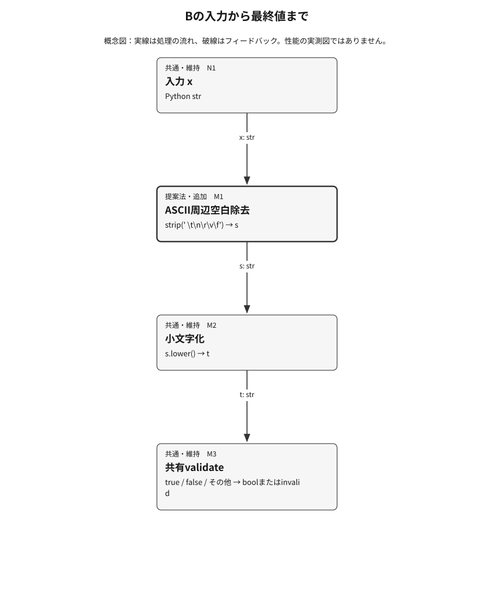
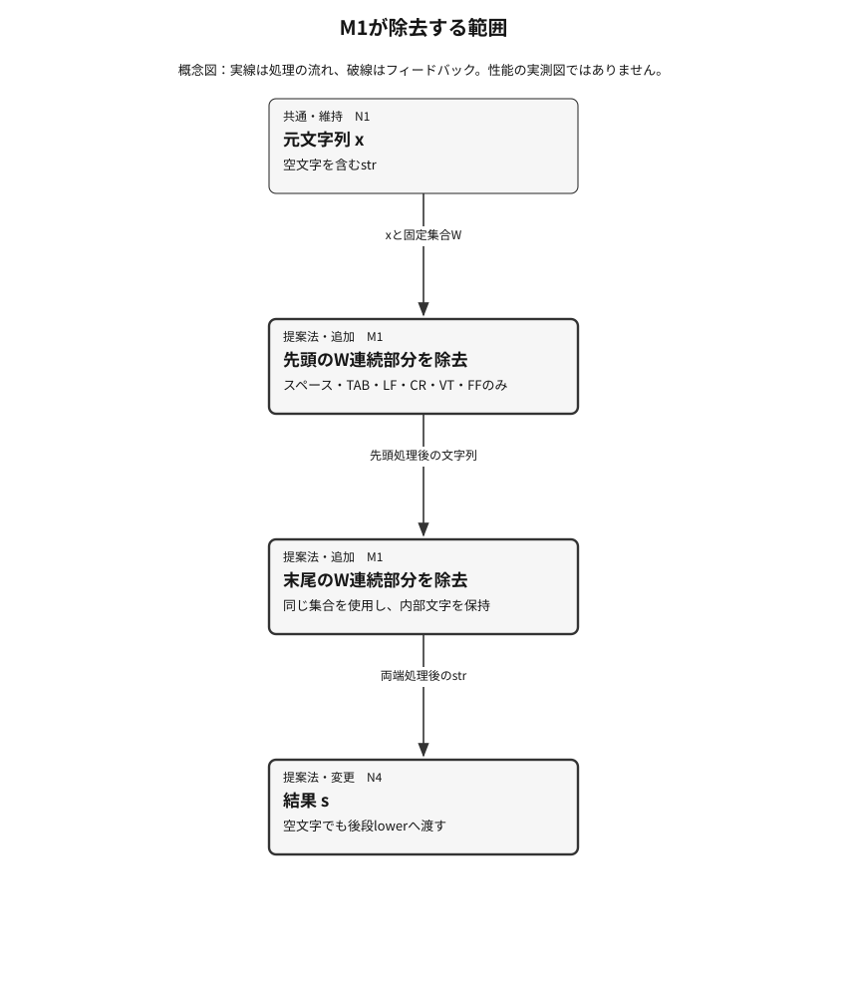

## 提案手法

**説明対象：B — ASCII-strip then lowercase parser**

設計記述と図の構造チェック済み。新規性・有効性・比較上の優越を認定するものではありません。

S5の最終成果物はcomplete=true、実行例外failures=\[\]で、14件の戻り値とAのt2・t3の誤りを保持する。S6はexit\_code=0、timed\_out=false、truncated=false。B\_S7にはPATH aliases用helper binariesを一時ディレクトリに作れなかった警告が残る。accuracyはA=0.7142857142857143、B=1.0、差=0.2857142857142857。K4はunknown、decisionはprovisional、独立レビューは未完了。遅延・メモリ・非ASCII空白・統計的有意性は未測定。図は説明定義であり、この単位では描画や視覚検査をしていない。

### ねらいと直感

Bは、周辺ASCII空白のため正しいboolean文字列を拒否するAの問題を、判定前の空白除去で修正する。受理語彙と出力型はAと同じである。保存済みE1は7件の範囲で5/7から7/7への改善を示す。

共有validateを変更せず、その前に指定ASCII周辺空白を除去すれば、t2・t3の誤出力を直し、残る5件の最終出力を維持できる。E1はこの固定fixture内の予測を支持する。

Aはlower後の文字列をそのままtrue・falseと比較するため、周辺空白が残ると一致しない。Bはvalue.strip\(' \\t\\n\\r\\v\\f'\).lower\(\)で周辺の指定6文字だけを除去してから同じvalidateへ渡す。これによりt2・t3は既存の受理トークンへ写り、yes・空文字・1は引き続きinvalidになる。出力型と判定語彙は変えず、内部空白や非ASCII空白は除去しない。効果の根拠はS5の実際の対応出力であり、処理図から効果を推定していない。

### 全体像と具体例

実測例t2: 入力は" true "。Aはlower後も周辺スペースが残りinvalidを返した。Bはstripで"true"にし、lower後の共有validateでPython True、JSON trueを返した。t3でもタブと改行の除去によりJSON falseを返した。t0=true、t1=false、t4・t5・t6=invalidは両方式で同じだった。中間文字列の説明は実装からの再構成で、中間値を別途測定した記録ではない。



**図1．Bの入力から最終値まで**　Bは指定ASCII空白除去を小文字化と共有validateの前に加える。処理概念図であり測定図ではない。

左から右へstrを受け渡す。addedのM1が介入点で、M2とM3の操作はAと共通。出力の実測根拠はS5である。

[図1の編集用定義](figures/27fd344bbae4c756911eb0bf2831a3684a0905ce5e51f3fb27f0a5ee54839313/F1.json)

### 構成要素の詳細

#### M1：指定ASCII周辺空白除去

**入力：** x: Python str  
**出力：** s: Python str

value.strip\(' \\t\\n\\r\\v\\f'\)で指定集合に属する先頭・末尾の連続文字を除去する。内部文字は残す。

**なぜ必要か：** FM1のトークン不一致を、比較前に不要な周辺文字を除くことで解消する。

**既存法との差分：** Aにはない追加処理。入力型と後段validateは維持する。

**追加コスト：** 解析上時間O\(n\)、一時領域O\(n\)。定数係数と実使用量は未測定。

#### M2：小文字化

**入力：** Bではs、Aではx: Python str  
**出力：** t: Python str

str.lower\(\)を一回適用する。

**なぜ必要か：** 大文字FALSEを共有受理語falseへ変換する。

**既存法との差分：** 操作は同じ。Bでは入力がASCII strip後の文字列になる。

**追加コスト：** 解析上時間O\(n\)、一時領域O\(n\)。実測性能なし。

#### M3：共有トークン検証

**入力：** t: Python str  
**出力：** Python True、Falseまたは文字列invalid

t=='true'ならTrue、t=='false'ならFalse、それ以外ならinvalidを返す。

**なぜ必要か：** 正規化と受理語彙を分離し、yes・空文字・1の誤受理を防ぐ。

**既存法との差分：** AとBで同じvalidateを使う。

**追加コスト：** 固定2トークンとの比較。全体の時間・領域上界はO\(n\)。追加学習パラメータなし。



**図2．M1が除去する範囲**　ASCII6文字の先頭・末尾の連続部分だけを除去し、内部を保持する。

図は一回のstripの意味を分解した説明であり、二回のstrip呼出しを指示していない。空文字でも定義される。非ASCII空白を同じ集合へ追加しない。

[図2の編集用定義](figures/27fd344bbae4c756911eb0bf2831a3684a0905ce5e51f3fb27f0a5ee54839313/F2.json)

### 記号・定式化とアルゴリズム

| 記号 | 意味 | 型・次元・範囲 |
|---|---|---|
| x | 元の入力文字列 | Python str、長さn&gt;=0 |
| W | 除去対象のASCII空白6文字 | 固定集合 \{U\+0020,U\+0009,U\+000A,U\+000D,U\+000B,U\+000C\} |
| s | strip\_W\(x\)の結果 | Python str、長さ0〜n |
| t | lower\(s\)の結果 | Python str |
| V | 共有validate関数 | str → boolまたは文字列invalid |

```math
xを入力str、Wをスペース・タブ・LF・CR・VT・FFの集合とする。s=strip_W(x)、t=lower(s)。V(t)はtがtrueならTrue、falseならFalse、その他なら文字列invalid。A(x)=V(lower(x))、B(x)=V(lower(strip_W(x)))。strip_Wは先頭と末尾のWの連続部分だけを除去し、内部文字を維持する。
```

strip\_Wは両端の指定空白だけを削り、lowerは文字の大小を正規化する。Vは正規化後の文字列を固定2語と比較して型付き値を返す。AとBの式の差はstrip\_Wだけであり、採点の正解値は式の入力に含まれない。

**擬似コード**

```text
1. parse_b(value: str)として入力を受ける。2. s=value.strip(' \t\n\r\v\f')を得る。3. t=s.lower()を得る。4. 共有validate(t)を呼び、t=='true'ならTrue、t=='false'ならFalse、それ以外なら文字列'invalid'を返す。5. 実験時のみ戻り値をJSONのbooleanまたは文字列として保存し、凍結正解と型および値が一致した場合だけ正解とする。例外を成功値に置き換えない。
```

### 学習・準備時と推論・実行時

**学習・準備時：** 学習・パラメータ推定・適応はない。ASCII6文字の集合、受理トークン、戻り値と7件の評価契約は固定済み。正解ラベルをparse\_bへ渡さず、戻り値取得後の採点にだけ使う。

**推論・実行時：** parse\_b\(value: str\)で周辺ASCII空白除去、lower、共有validateの順に処理する。出力はTrue、False、文字列invalidのいずれか。E1ではJSONへ保存した最終値を型付きで採点した。

### 既存法との差分とトレードオフ

| 観点 | 既存法 | 提案法 | 代償・成立条件 |
|---|---|---|---|
| 周辺ASCII空白 | 除去しないためt2・t3でinvalid | M1を追加しt2=true、t3=false | 空白を拒否する別仕様には適合しない。 |
| 大小文字・受理語彙・出力型 | lowerと共有validateでtrue・falseだけを受理 | 同じM2・M3を維持 | 語彙拡張や内部空白修復は行わない。 |
| 資源 | 解析上O\(n\)時間・一時領域 | 同じ漸近上界でstrip工程を追加 | 実際の遅延と割当量は未測定。 |


**図3．AとBの共通工程と追加工程**　Aはlowerから開始し、Bはその前にASCII stripを追加する。下流の検証は同じ。

baselineとproposalの2経路を並べて読む。addedはBのstrip、modifiedはlowerへ入る文字列、unchangedは同じ小文字化操作と検証規則を示す。Bのlowerの操作自体は変わらない。t2・t3の実際の出力差はS5を参照する。

[図3の編集用定義](figures/27fd344bbae4c756911eb0bf2831a3684a0905ce5e51f3fb27f0a5ee54839313/F3.json)

### 先行研究からの導入と独自部分

起点はS1のboolean設定値要件、実装根拠はS7である。判定前の局所正規化を対象操作へ適用し、validateの受理語彙と出力型を保持する。周辺ASCII空白を許す前提に変更するため、厳密に空白を拒否したい用途とは非互換。最小実装はparse\_bのstrip追加だけで、他領域の研究成果を移植したという主張はしない。

最も近い既存実装はS7に保存されたparse\_bそのものであり、S1にも同じstrip後のlowerという操作が指定されている。今回の貢献はこの既存方式の形式化と実測結果に結び付く説明で、アルゴリズムの新規性ではない。独立した一次研究2件の調査はなく、文献新規性は未検証。

**新規性の記録：** overlaps\_prior\_art（自動認定ではありません）

- S1：Bound boolean-parser requirements。確認箇所：Entire requirements paragraph。出典の詳細は主張・根拠の台帳を参照。
- S2：Frozen evaluation contract。確認箇所：candidate\_ids, tasks, controls, metrics\[0\], limitations。出典の詳細は主張・根拠の台帳を参照。
- S5：Actual E1 paired final outputs。確認箇所：contract\_sha256, tasks, trials, complete, failures, accuracy, paired\_difference。出典の詳細は主張・根拠の台帳を参照。
- S6：Parent-owned E1 execution receipt。確認箇所：command, experiment\_id, source\_fingerprint, exit\_code, timed\_out, truncated, outputs, artifacts。出典の詳細は主張・根拠の台帳を参照。
- S7：Executed Python comparison implementation。確認箇所：CONTRACT\_SHA256, FROZEN\_TASKS, validate, parse\_a, parse\_b, main。出典の詳細は主張・根拠の台帳を参照。
- B\_S7：E1 original stderr。確認箇所：Entire warning line beginning WARNING: proceeding。出典の詳細は主張・根拠の台帳を参照。

### 実装への組込みと計算負担

保存済みS7のparse\_b\(value: str\)が統合点であり、parse\_aとvalidateは比較基準として維持する。Python標準のstr処理だけで追加依存や学習は不要。文字列入力とboolまたはinvalidの出力インターフェースは同じだが、周辺ASCII空白を持つ入力の受理挙動は意図的に変わる。要件外の本番コード変更はこの単位では行わない。

解析上、入力長nに対して両方式は時間O\(n\)、一時文字列領域O\(n\)。Bはstripの走査と中間文字列を追加する。定数係数、実際の割当量、遅延、メモリは未測定で、receiptの全体実行時間をパーサ性能とみなさない。

### なぜこの案を詳しく検討するか

唯一の指定提案Bは、共有validateを維持する小さい変更でAの実測誤出力2件を説明し、固定fixtureで2/7の改善を得たため詳述する。新規手法という位置付けではなく既存方式の形式化である。保存済み判断と一致するが、K4未確認と独立レビュー未完了により最終推奨は条件付きのまま。

Bは唯一の指定非baseline候補で、説明対象として選ぶ。dossier.decision.candidate\_idもBで一致するが、実測差だけで最終承認とはしない。K4確認と独立レビューを残す条件付き判断を維持する。

比較の目安は全5手法。現在の比較はベースライン1＋提案候補1。アブレーションを数合わせに使いません。

**比較数の例外理由：** 既定の全5方式に対し、要件と凍結済み評価契約はA・Bの2方式だけを明示的に指定している。介入はASCII空白除去の有無に固定され、入力・採点規則・実行予算も凍結済みである。追加候補は依頼範囲と比較条件を変えるため作らず、ベースラインAと実質的な提案Bの1案に限定する。

### 成立条件・反論と設計の改訂

**成立条件**

- 入力はstrで、周辺の指定ASCII空白を許容する要件である。
- 受理語彙は大小文字を無視したtrue・falseに限り、その他は文字列invalidとする。
- E1の固定7件と凍結ラベルだけを有効性の判断対象とする。

**主要な反論**

- 周辺空白付きの2件を含む小さいfixtureなので、改善を一般用途へ広げる根拠にはならない。
- 改善は標準文字列処理の追加で説明でき、新しいアルゴリズムを必要としない。
- 期待値や入力を候補別に変えれば差を作れるため、正規化の効果と評価混入を区別する必要がある。
- E1の成功はK4の宣言配置や全禁止事項の順守、独立レビューの完了を証明しない。

**反論を受けた改訂**

- 説明と結論を固定7件に限定し、一般性能と非ASCII空白は未測定と記した。
- 既存方式のrepairとして扱い、新規性を主張せずS7との同一性を明示した。
- 共有validate、凍結fixtureガード、型付き採点と14件の実際の対応出力を説明の根拠にした。
- K4=unknownとdecision=provisionalを保持した。独立レビューをこの記述作業で完了扱いしない。

**失敗すると予想される条件：** 非ASCII空白の除去、内部空白の修正、yesや1の受理は対象外。str以外は例外になり得る。周辺空白を不正とする別仕様ではBの受理拡大が誤りになる。7件での7/7は一般入力の完全性を保証しない。

### 仮説と検証実験の対応

| 仮説 | 対象 | 実験 | 競合する説明 | 棄却・修正する条件 |
|---|---|---|---|---|
| M1がt2・t3の周辺ASCII空白を除くことで誤出力を直す。 | M1, M2, M3 | E1：executed | 入力や正解の差、別validateの使用が改善を作った可能性。共有validate、凍結入力ガードと対応記録で区別する。 | 実際のt2・t3でBが正しいbooleanを返さない、または実装差がstrip以外にも存在すれば機構説明を棄却または修正する。 |
| 追加正規化は残る5件の最終出力を維持し、固定7件で1/7以上改善する。 | M1, M2, M3 | E1：executed | 2件の改善と別入力の退行が相殺される、または型を無視した採点で見かけの成功になる。 | 残る5件に退行がある、型付き採点の差が1/7未満、または最終出力・receiptが欠ける場合は主張を修正する。 |

図はこの設計の説明用です。結果の主張は後続の実験記録と結び付け、未実験の利点は仮説として扱います。
