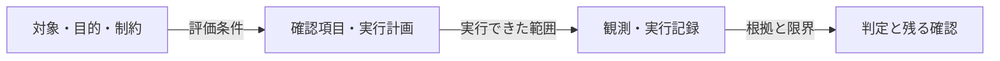

<!-- Generated by design-research compact-v1 -->
# 調査・検証報告

実行ID: 20261010T141626Z-c3872498 / **passed** / 段階: reviewed / 反復: 2
更新: 2026-10-10T14:35:37.020803+00:00

## 結論と確認してほしいこと

Required evidence, reporting and independent review complete

課題: Fix parse_bool so that surrounding whitespace is accepted for true/false; preserve ValueError for all other strings. Reproduce with existing unittest, change only parser.py, verify and independently review. No literature comparison is needed.
対象版: Git管理なし

## 保存した工程と残る作業

| 工程 | 状態 | 必須 |
|---|---|---|
| 001-planner | complete | Yes |
| 001-review-whitespace | complete | Yes |
| 001-review-invalid | complete | Yes |
| 001-review-scope | complete | Yes |
| 001-review-review | complete | Yes |
| 002-fixer | complete | Yes |
| 002-review-whitespace | complete | Yes |
| 002-review-invalid | complete | Yes |
| 002-review-scope | complete | Yes |
| 002-review-review | complete | Yes |

実測が保存されていても、必須の説明・独立レビューが未完了なら全体は完了していません。

未解消: Critical 0件 / High 0件 / Medium 0件 / Low 0件

## はじめて読む方へ：検証の範囲

目的：Accept surrounding whitespace when parsing true/false, preserve ValueError for other strings, change only parser.py, and verify through existing unittest and independent review.

基準となる動作・構成：parser.py uses text.lower() without stripping whitespace. Source inspection predicts test_whitespace fails on " True "; test_invalid covers "yes", "", and "1". These predictions require execution receipts.

### 図：この報告を作る確認の流れ

以下は検証の段取り図であり、対象アプリの未確認な内部アーキテクチャを示すものではありません。

**図の読み方：** 対象から判定までを左から右へ追います。計画だけの確認と、実行記録を伴う確認は別です。

現在の記録：この反復の実行記録 1 件。レビュー記録あり。件数や図の存在は合格を意味しません。

実測は実行記録で確認した範囲、静的確認はコード等から読めた範囲、未確認は証拠が不足している範囲です。

対象とした具体的な入力・操作、期待と実際の差は、以下の確認項目と所見で説明します。

## 調査・比較・検証

対象: backend
目的: Accept surrounding whitespace when parsing true/false, preserve ValueError for other strings, change only parser.py, and verify through existing unittest and independent review.
基準案: parser.py uses text.lower() without stripping whitespace. Source inspection predicts test_whitespace fails on " True "; test_invalid covers "yes", "", and "1". These predictions require execution receipts.

### 確認結果

| 確認対象 | 必須 | 結果 | 根拠・限界 |
|---|---|---|---|
| whitespace: Parse whitespace-surrounded boolean strings | Yes | pass | The preserved baseline stderr shows test_whitespace raising ValueError on " True " and the receipt records exit 1. The current receipt records exit 0, no timeout or truncation, and stderr reports test_whitespace ... ok. The unchanged test asserts both required boolean results. Current parser/test SHA-256 hashes match the successful receipt. The second baseline assertion was not reached; its post-change assertion passed. [EV-00001](../001-checks/001/receipt.json), [EV-00004](../001-checks/001/stderr.log), [EV-00012](../002-checks/001/receipt.json), [EV-00013](../002-code/whitespace_CE-W-001.json), [EV-00014](../002-code/whitespace_CE-W-002.json) |
| invalid: Reject strings outside normalized true/false | Yes | pass | Baseline and post-change stderr both report ParseTests.test_invalid passing for yes, empty string, and 1. The baseline suite failure is preserved: exit 1 due to test_whitespace. The current post-change receipt exits 0, with no timeout or truncation, and its parser/test hashes match the current files. Source inspection confirms that only strings equal to true or false after strip().lower() return booleans; all other strings reach ValueError. Runtime evidence covers the existing three invalid cases; the general rejection property follows from source inspection. [EV-00001](../001-checks/001/receipt.json), [EV-00004](../001-checks/001/stderr.log), [EV-00012](../002-checks/001/receipt.json), [EV-00015](../002-checks/001/stderr.log), [EV-00016](../source-inputs/7d52d30ee267bc6c9164992d284fc8210c1e997b9800b58f5de9f1894f2dbef5/parser.py), [EV-00017](../source-inputs/7d52d30ee267bc6c9164992d284fc8210c1e997b9800b58f5de9f1894f2dbef5/test_parser.py) |
| scope: Keep the implementation change minimal | Yes | pass | Snapshot-to-current comparison shows one changed expression in parser.py: text.strip().lower(). The signature, exact case-insensitive comparisons, boolean returns, and ValueError fallback remain unchanged. Baseline and post-change receipt fingerprints differ only for parser.py among the three fixture files, and current hashes match the post-change receipt. That receipt records exit 0 with both existing tests passing. The baseline failure remains preserved. Git repository history was unavailable; scope is established from the saved originals and fixture fingerprints. [EV-00007](../source-inputs/parser.py), [EV-00016](../source-inputs/7d52d30ee267bc6c9164992d284fc8210c1e997b9800b58f5de9f1894f2dbef5/parser.py), [EV-00001](../001-checks/001/receipt.json), [EV-00012](../002-checks/001/receipt.json), [EV-00015](../002-checks/001/stderr.log) |
| review: Independently verify the final fix | Yes | pass | Inspected current parser.py and existing tests, compared both against their baseline snapshots, and read original receipt/stdout/stderr for both executions. Only parser line 2 changes to text.strip().lower(); tests remain identical. Baseline failure is preserved. The current successful receipt matches current file hashes, is neither timed out nor truncated, exits 0, and reports two tests passing. The baseline second whitespace assertion was not reached; its post-change execution succeeds. No tests were rerun. [EV-00001](../001-checks/001/receipt.json), [EV-00004](../001-checks/001/stderr.log), [EV-00012](../002-checks/001/receipt.json), [EV-00015](../002-checks/001/stderr.log), [EV-00016](../source-inputs/7d52d30ee267bc6c9164992d284fc8210c1e997b9800b58f5de9f1894f2dbef5/parser.py), [EV-00017](../source-inputs/7d52d30ee267bc6c9164992d284fc8210c1e997b9800b58f5de9f1894f2dbef5/test_parser.py) |

### 複雑さの評価

See scoped independent reviews; The fix adds strip() to the existing normalization expression while retaining two comparisons and a ValueError fallback, without dependencies or additional branches.; The repair retains one normalization expression, two comparisons, and a ValueError fallback. Adding strip() introduces no dependencies or additional parsing branches.; The repair adds strip() to the existing normalization expression. It retains two comparisons and a ValueError fallback, without dependencies or additional branches.; The fix adds strip() to the existing normalization expression while preserving two comparisons and the ValueError fallback. No dependencies or additional branches are introduced.
評価: 許容

## 変更と再検証

修正担当の申告と独立した再確認を分けます。

### 反復 2

Changed normalization to text.strip().lower(), preserving comparisons and ValueError fallback. Baseline receipt records the whitespace failure. Checks were not executed; post-change verification and independent review remain pending.
変更ファイル: parser.py

### whitespace_whitespace-001: Whitespace parsing remains broken

変更前の証拠:

- [EV-00001: Actual execution: python3 -m unittest -v](../001-checks/001/receipt.json)

変更後の独立レビュー:

- [EV-00001: Actual execution: python3 -m unittest -v](../001-checks/001/receipt.json)
- [EV-00004: Original unittest failure output](../001-checks/001/stderr.log)
- [EV-00012: Actual execution: python3 -m unittest -v](../002-checks/001/receipt.json)
- [EV-00013: Current parser strips surrounding whitespace before lowercasing, retains two exact comparisons and the ValueError fallback. SHA-256 e9793630d019d5e862a5980349a1a2c05c9c6f1c661417d5efc362ed1ae7dfc1 matches the successful receipt.](../002-code/whitespace_CE-W-001.json)
- [EV-00014: Existing test asserts True for " True " and False for "\tFALSE\n". SHA-256 2fcf1f4acd632aefe1a510648702ffbf516d2b1303d71195441f2b5940f9c806 matches both receipts.](../002-code/whitespace_CE-W-002.json)

### invalid_INVALID-001: Post-modification invalid-string preservation is unverified

変更前の証拠:

- [EV-00001: Actual execution: python3 -m unittest -v](../001-checks/001/receipt.json)
- [EV-00004: Original unittest failure output](../001-checks/001/stderr.log)
- [EV-00005: Current original source lowercases without stripping whitespace, returns booleans only for exact true/false comparisons, and otherwise raises ValueError.](../001-code/invalid_CE-invalid-001.json)

変更後の独立レビュー:

- [EV-00001: Actual execution: python3 -m unittest -v](../001-checks/001/receipt.json)
- [EV-00004: Original unittest failure output](../001-checks/001/stderr.log)
- [EV-00012: Actual execution: python3 -m unittest -v](../002-checks/001/receipt.json)
- [EV-00015: Post-change unittest output](../002-checks/001/stderr.log)
- [EV-00016: Actual repaired parser](../source-inputs/7d52d30ee267bc6c9164992d284fc8210c1e997b9800b58f5de9f1894f2dbef5/parser.py)
- [EV-00017: Existing whitespace assertions](../source-inputs/7d52d30ee267bc6c9164992d284fc8210c1e997b9800b58f5de9f1894f2dbef5/test_parser.py)

### scope_scope-001: Required whitespace normalization is absent

変更前の証拠:

- [EV-00007: Current parser source](../source-inputs/parser.py)
- [EV-00001: Actual execution: python3 -m unittest -v](../001-checks/001/receipt.json)
- [EV-00004: Original unittest failure output](../001-checks/001/stderr.log)

変更後の独立レビュー:

- [EV-00007: Current parser source](../source-inputs/parser.py)
- [EV-00016: Actual repaired parser](../source-inputs/7d52d30ee267bc6c9164992d284fc8210c1e997b9800b58f5de9f1894f2dbef5/parser.py)
- [EV-00001: Actual execution: python3 -m unittest -v](../001-checks/001/receipt.json)
- [EV-00012: Actual execution: python3 -m unittest -v](../002-checks/001/receipt.json)
- [EV-00015: Post-change unittest output](../002-checks/001/stderr.log)

### review_review-001: Final fix and successful verification are absent

変更前の証拠:

- [EV-00001: Actual execution: python3 -m unittest -v](../001-checks/001/receipt.json)
- [EV-00004: Original unittest failure output](../001-checks/001/stderr.log)
- [EV-00007: Current parser source](../source-inputs/parser.py)
- [EV-00008: Existing invalid-string test](../source-inputs/test_parser.py)

変更後の独立レビュー:

- [EV-00001: Actual execution: python3 -m unittest -v](../001-checks/001/receipt.json)
- [EV-00004: Original unittest failure output](../001-checks/001/stderr.log)
- [EV-00012: Actual execution: python3 -m unittest -v](../002-checks/001/receipt.json)
- [EV-00015: Post-change unittest output](../002-checks/001/stderr.log)
- [EV-00016: Actual repaired parser](../source-inputs/7d52d30ee267bc6c9164992d284fc8210c1e997b9800b58f5de9f1894f2dbef5/parser.py)
- [EV-00017: Existing whitespace assertions](../source-inputs/7d52d30ee267bc6c9164992d284fc8210c1e997b9800b58f5de9f1894f2dbef5/test_parser.py)

## 残る確認と実行記録

Required evidence, reporting and independent review complete
実測・AIによる評価の範囲を示しています。人間の利用確認、本番運用、方式の普遍的な有効性は未確認です。
中断した修正の差分は保持し、新しいaudit/runで再検証します。

[実行状態](../state.json) · [機械用の状態](status.json)
