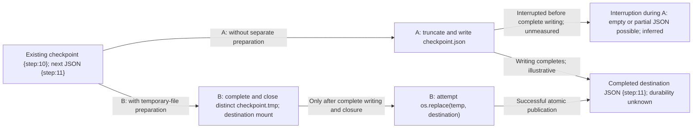
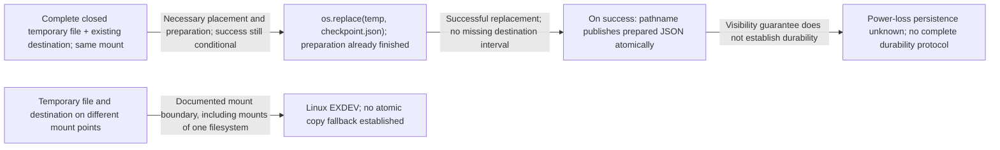

<!-- Generated by design-research compact-v1 -->
# 調査・検証報告

実行ID: 20261010T141626Z-4ca67d1d / **research_complete** / 段階: reviewed / 反復: 2
更新: 2026-10-10T16:12:16.128622+00:00

## 結論と確認してほしいこと

Required evidence, reporting and independent review complete

課題: Answer the narrow checkpoint design question in requirements.md with a conditional source-grounded conclusion, no experiment required. Read only decisive Python os.replace and Linux rename(2) primary passages. Explain atomicity vs durability, same-filesystem constraints. Two-candidate exception is appropriate. Complete the explanation and independent review.
対象版: Git管理なし

## 保存した工程と残る作業

| 工程 | 状態 | 必須 |
|---|---|---|
| 001-planner | complete | Yes |
| 001-producer-design | complete | Yes |
| 001-producer-assets | complete | Yes |
| 001-producer-results | complete | Yes |
| 001-evidence-A | complete | Yes |
| 001-evidence-B | complete | Yes |
| 001-producer-reader | complete | Yes |
| 001-reviewer-dossier | complete | Yes |
| 001-review-R1 | complete | Yes |
| 001-review-R2 | complete | Yes |
| 001-review-R3 | complete | Yes |
| 001-review-R4 | complete | Yes |
| 001-review-R5 | complete | Yes |
| 002-producer-design | complete | Yes |
| 002-producer-assets | complete | Yes |
| 002-producer-results | complete | Yes |
| 002-evidence-A | complete | Yes |
| 002-evidence-B | complete | Yes |
| 002-producer-reader | complete | Yes |
| 002-review-R1 | complete | Yes |
| 002-review-R2 | complete | Yes |
| 002-review-R3 | complete | Yes |
| 002-review-R4 | complete | Yes |
| 002-review-R5 | complete | Yes |
| 002-reviewer-dossier | complete | Yes |

実測が保存されていても、必須の説明・独立レビューが未完了なら全体は完了していません。

提案: **Complete temporary file followed by os.replace**（provisional）
Prefer B when complete checkpoint publication matters, conditional on completed preparation and successful replacement on the destination mount. A remains reasonable when interrupted-update loss is acceptable and fewer lifecycle steps are preferred. Neither has an established durability guarantee. Independent qualitative review of this revision passed R1–R5. This remains an unmeasured design recommendation, with parent provenance assessment unresolved and no empirical acceptance.

判断待ち・未確認: Parent provenance assessment remains unresolved.; Registered man7 retrieval failures remain unchanged; the accessible 2021 original does not verify the unavailable newer version.; Interruption outcomes, latency, failure frequencies and crash durability remain unmeasured.
見直す条件: Independent review challenges the source interpretation or conditional choice.; Power-loss persistence or another filesystem scope becomes required.

研究の完了は方式の採用承認を意味しません。

未解消: Critical 0件 / High 0件 / Medium 0件 / Low 0件

## 主要指標と具体的な差

研究の目的: design

対象入力: One design question from the bound requirements; no empirical dataset.
統制条件: Same checkpoint scope and JSON-completeness goal for both candidates; Separate documented guarantees from mechanism-based inference; Use only the two named primary sources; Label illustrations as unmeasured; Preserve failed retrieval and unsupported conclusions
予算・測定範囲: One narrow explanation and independent review; zero experiments.
適用限界: No efficacy, latency, power-loss or filesystem-specific durability measurements. Linux rename(2) retrieval currently failed; completion requires its decisive passages. No complete durability protocol can be established from the named passages alone.

**主要効果は未測定です。効果の改善・不改善の結論は出せません。**

## はじめて読む方へ

### 何を解決するか

Prefer B, complete temporary-file replacement, when publishing a complete checkpoint matters; prefer A, direct truncating rewrite, only when interrupted-update checkpoint loss is acceptable and fewer lifecycle steps are preferred. This conditional design conclusion addresses a program saving JSON for later restart. Independent qualitative review of the current explanation passed R1–R5; reliability and power-loss durability remain unmeasured.

対象・対象外：Two frozen mechanisms for one writer updating an existing complete JSON checkpoint. B uses a distinct temporary file on the destination mounted filesystem, completes and closes it before replacement, and performs no subsequent mutation. Only the decisive Python os.replace and 2021 Linux rename(2) original passages support the documented replacement guarantees.

現時点の要点：B separates preparation from publication: successful replacement publishes the prepared file atomically, while the preceding writes remain separate. Python documents atomic renaming on success and possible cross-filesystem failure ([Python os.replace](https://docs.python.org/3/library/os.html#os.replace), registered S1). Linux documents atomic destination replacement and EXDEV across different mount points, even mounts of the same filesystem ([Linux rename(2) original](https://raw.githubusercontent.com/mkerrisk/man-pages/master/man2/rename.2), registered SUPP_LINUX_RAW). Neither passage establishes persistence after power loss; completing and closing a file does not establish a complete durability protocol.

### 具体的な利用例・入力から出力まで

Concrete with/without example, illustrative and unmeasured: checkpoint.json initially contains {"step":10}; the next checkpoint is {"step":11}. Without temporary-file replacement, A truncates checkpoint.json and writes the new JSON into that same file. Interruption after truncation or after writing only {"step": can leave empty or incomplete JSON; this is reasoning from the specified mechanism, not an observed failure. With B, the writer prepares checkpoint.tmp beside checkpoint.json. While the temporary file is incomplete, the destination still refers to the old checkpoint under the stated scope. After complete writing and closure, os.replace(checkpoint.tmp, checkpoint.json) publishes the new file if replacement succeeds. Figure F1 compares these paths; F2 expands the publication boundary rather than repeating the overview. Placing the temporary file beside the destination addresses the mount constraint, but does not ensure success. A cross-filesystem copy fallback would be a different mechanism and cannot inherit this atomic replacement guarantee. The Linux descriptor sentence directly concerns open descriptors for the source oldpath; readers already holding the old destination retaining that file is an inference, not that sentence's explicit guarantee. This example and both figures are explanations, not executed traces.

### 用語と前提

Checkpoint: saved program state used on restart. Truncation: reducing the destination to zero length before rewriting in candidate A. Preparation: writing and closing B's distinct temporary file. Publication: replacing the destination pathname with that prepared file. Atomic replacement: a successful indivisible pathname change; Linux describes no interval in which an existing destination pathname is missing. Durability: persistence after power loss or system crash, which remains unknown here. Mounted filesystem: the rename placement boundary; Linux reports EXDEV across different mount points.

## 全体像から詳細へ

### 図1. Two paths from old checkpoint to new JSON

Unmeasured mechanism illustration. A modifies the published destination during writing; B prepares a separate file before publication. No timing or failure rate is encoded.

**図の読み方：** Start at Update and follow either labeled candidate branch. Arrows indicate logical processing order, not elapsed time. Publication is the B component expanded in F2.

図を表示できない場合：Next JSON {step:11}: A truncates and rewrites checkpoint.json, risking incomplete content by mechanism reasoning; B prepares and closes checkpoint.tmp, then attempts replacement to publish complete JSON. Neither path establishes crash durability.

### 図2. Publication boundary and mount constraint

Unmeasured expansion of F1 Publication. Shows preconditions, the successful pathname change and the EXDEV boundary; it depicts no persistence protocol or measured outcome.

**図の読み方：** Read Ready to Replace to Published for the conditional successful path. Follow OtherMount to EXDEV for the excluded placement. Arrows identify preconditions and documented outcomes, not probabilities. Published to Unknown marks the limit of evidence.

図を表示できない場合：With a complete closed distinct temporary file and existing old destination on the same mount, successful replacement publishes the prepared file atomically. Different mount points cause Linux EXDEV. Preparation is outside replacement atomicity; crash persistence remains unknown.

拡大元：F1 の Publication。

図と説明の適用範囲：Tested scope: none. There are zero experimental tasks, paired trials, metrics, successful experiment receipts or exported paired-result JSON. No latency, interrupted-update outcomes, failure frequencies or filesystem-specific crash durability were measured. Current independent qualitative review is complete, with R1–R5 passing; these grades establish review of the explanation, not empirical effectiveness or human acceptance. Parent provenance assessment remains unresolved. Registered man7 retrieval timeouts remain failures; earlier narrative also records Internal Error and DNS failures. Successful retrieval of the separately registered 2021 original closes decisive-passage support within that dated scope and does not verify the unavailable newer page. Transport receipts establish access, not mechanism efficacy. Figure rendering and reader understanding were not tested.

## 調査・比較・検証

対象: research
目的: Compare two mechanisms for a single-process JSON checkpoint and produce a conditional, source-grounded recommendation with independent review.
基準案: A: directly truncate and rewrite the checkpoint file. B: write complete JSON to a temporary file on the destination filesystem, close it, then publish with os.replace.

### 比較条件

One writer, an existing complete checkpoint, a distinct temporary file and no subsequent mutation; frozen candidates A and B only. Design comparison with zero experiments.

- hard: Require independent review of the final explanation and parent provenance assessment; producer interpretation cannot satisfy this requirement.
- soft: Use only decisive Python os.replace and Linux rename(2) primary passages; separate documented guarantees, conditional inference and unknown effects.
- soft: Two-candidate exception: the expressly requested narrow mechanisms make five candidates a scope expansion.
- soft: Zero experiments, performance claims, fabricated receipts or empirical acceptance.

### 候補の比較

| 方式 | 評価軸 | 結果 | 根拠の種類 |
|---|---|---|---|
| Direct truncating rewrite | Atomic publication | The successful-replacement guarantee does not establish atomic publication for A. Empty or partial JSON after interrupted rewriting remains a mechanism hypothesis; prefer completed temporary-file replacement when preserving a complete checkpoint during updates is required. | unknown |
| Direct truncating rewrite | Durability | Power-loss and system-crash persistence remain unknown. Atomic visibility cannot establish durability, and the named passages supply no complete persistence protocol. | unknown |
| Direct truncating rewrite | Filesystem applicability | A specifies no rename between paths, so the replacement alternative's same-mount constraint is not a placement condition in A's flow. Actual direct-write success remains unassessed. | unknown |
| Direct truncating rewrite | Operational complexity | A specifies fewer lifecycle steps. Its conditional appeal is simpler writes when interrupted-update checkpoint loss is acceptable; latency, failure rates and recovery costs are unmeasured. | unknown |
| Complete temporary file followed by os.replace | Atomic publication | Successful replacement is documented; complete-JSON publication and conditional preference over A are inferences under B’s preparation assumptions. | reported |
| Complete temporary file followed by os.replace | Durability | Crash persistence unknown; no measured advantage over A or complete persistence protocol established. | unknown |
| Complete temporary file followed by os.replace | Filesystem applicability | Use the destination mount, preferably its directory; placement alone does not guarantee success. Treat replacement errors as failures. | reported |
| Complete temporary file followed by os.replace | Operational complexity | Additional lifecycle steps relative to A; operational effects unmeasured. | unknown |

### 主張と根拠

#### C1（reported）

Python documents replacement of an existing destination file, atomic renaming on success and possible cross-filesystem failure.
条件: os.replace documentation
限界: Does not establish atomic preceding writes or crash persistence.

- [S1: Python documentation: os.replace](https://docs.python.org/3/library/os.html#os.replace) / supports / os.replace, lines 1833–1836
#### C2（reported）

Linux documents atomic destination replacement, unaffected source descriptors and EXDEV across different mounts, including mounts of one filesystem.
条件: 2021-08-27 Linux rename(2) original source
限界: Placement alone does not ensure success; this version does not verify the unavailable newer page.

- [SUPP_LINUX_RAW: Linux rename(2) original manual source in the author repository](https://raw.githubusercontent.com/mkerrisk/man-pages/master/man2/rename.2) / supports / DESCRIPTION lines 66–105; ERRORS EXDEV lines 426–432
#### C3（hypothesis）

Interruption between A's truncation and completed writing can leave an empty or partial checkpoint. A specifies fewer lifecycle steps than B.
条件: Reasoning from the supplied truncate-then-write mechanism
限界: The permitted passages do not document truncating writes; no interruption outcomes, failure rates or timing measured.

#### C4（unknown）

Power-loss and system-crash durability are unknown for both candidates. Atomic visibility and closure do not establish a complete persistence protocol from these passages.
条件: Evidence boundary
限界: No synchronization protocol or filesystem-specific persistence assessment established.

#### C5（inferred）

B conditionally publishes completed JSON through successful replacement; preparation is separate. Existing destination readers retaining old file references is an inference.
条件: Single writer; distinct complete temporary file on destination mount; closed before replacement; no subsequent mutation
限界: Interruption outcomes unmeasured.

- [S1: Python documentation: os.replace](https://docs.python.org/3/library/os.html#os.replace) / supports / os.replace, lines 1833–1836
- [SUPP_LINUX_RAW: Linux rename(2) original manual source in the author repository](https://raw.githubusercontent.com/mkerrisk/man-pages/master/man2/rename.2) / supports / DESCRIPTION lines 66–105; ERRORS EXDEV lines 426–432
#### C6（hypothesis）

B adds temporary-file preparation, lifecycle handling and replacement; A has no rename placement boundary.
条件: Structural comparison of the frozen mechanisms
限界: No implementation inspected; operational costs and actual write applicability unknown.

#### A-C1（reported）

Python documents atomic renaming on successful os.replace and possible failure across filesystems. This guarantee concerns replacement, rather than direct truncating writes.
条件: Python 3.15.0 os.replace documentation; contrast for candidate A
限界: The passage does not specify truncating-write behavior or a persistence protocol.

- [A-S1: Python documentation: os.replace](https://docs.python.org/3/library/os.html#os.replace) / supports / os.replace, lines 1833–1836
#### A-C2（reported）

Linux documents atomic replacement of an existing destination, unaffected source-file descriptors, and EXDEV across different mount points, even mounts of the same filesystem.
条件: 2021-08-27 rename(2) source; replacement contrast for candidate A
限界: This older source does not verify the unavailable newer man7 page.; The descriptor statement explicitly concerns oldpath; behavior of previously opened destination readers is not directly established by this sentence.

- [A-LINUX-RAW: Linux rename(2) original manual source in the author repository](https://raw.githubusercontent.com/mkerrisk/man-pages/master/man2/rename.2) / supports / DESCRIPTION lines 66–105; ERRORS EXDEV lines 426–432
#### A-C3（hypothesis）

For the specified truncate-then-write mechanism, interruption after truncation and before complete JSON writing can leave an empty or partial checkpoint. A therefore appears reasonable only when such interrupted-update checkpoint loss is acceptable.
条件: Mechanism reasoning from the supplied candidate A definition; one writer and an existing complete checkpoint
限界: The permitted primary passages do not document truncating writes.; No implementation or interrupted-update outcome was tested; no failure probability is claimed.

#### A-C4（unknown）

Candidate A's persistence after power loss or system crash is unknown. The replacement passages establish no complete durability protocol for either mechanism; atomic pathname publication is insufficient evidence of durability.
条件: Boundary of the two named primary passages
限界: No synchronization protocol or filesystem-specific persistence assessment is established.; No power-loss or system-crash measurements exist.

#### A-C5（hypothesis）

A has no source-to-destination rename placement boundary in its specified flow. It has fewer specified lifecycle steps than temporary-file preparation followed by replacement, but actual write applicability and operational effects remain unassessed.
条件: Structural reasoning from the supplied mechanisms
限界: No implementation was inspected.; Fewer steps do not establish lower latency, fewer failures or broader filesystem support.

#### A-C6（inferred）

The documented rename placement constraint supports preparing a replacement temporary file on the destination's mounted filesystem, preferably in its directory. This is a condition for the replacement alternative rather than a constraint on A's specified flow.
条件: Linux replacement alternative used solely to contextualize candidate A
限界: Placement does not ensure operation success.; A cross-filesystem copy fallback has no atomic-replacement guarantee in these passages.

- [A-S1: Python documentation: os.replace](https://docs.python.org/3/library/os.html#os.replace) / supports / os.replace, lines 1833–1836
- [A-LINUX-RAW: Linux rename(2) original manual source in the author repository](https://raw.githubusercontent.com/mkerrisk/man-pages/master/man2/rename.2) / supports / ERRORS EXDEV lines 426–432
#### B-C1（reported）

Python documents atomic renaming on success, replacement of an existing destination file subject to permission, and possible failure across filesystems.
条件: Python os.replace documentation
限界: Does not establish atomic preparation or crash persistence.

- [B-S1: Python documentation: os.replace](https://docs.python.org/3/library/os.html#os.replace) / supports / os.replace, lines 1833–1836
#### B-C2（reported）

Linux documents atomic replacement without a missing-destination interval; open source descriptors are unaffected. EXDEV applies across mount points, including separate mounts of one filesystem.
条件: 2021-08-27 Linux rename(2) manual source
限界: Same-mount placement does not ensure success.; Earlier man7 retrieval failures remain; this source does not verify that unavailable page’s version.

- [B-LINUX-RAW: Linux rename(2) original manual source in the author repository](https://raw.githubusercontent.com/mkerrisk/man-pages/master/man2/rename.2) / supports / DESCRIPTION lines 66–105; ERRORS EXDEV lines 426–432
#### B-C3（inferred）

Given complete JSON prepared in a distinct closed temporary file, one writer, no subsequent mutation and successful replacement, B publishes the completed checkpoint through atomic pathname replacement. Preparation is a separate sequence; readers retaining references to the old destination may continue reading it, an inference rather than an explicit destination-descriptor statement.
条件: Frozen single-process checkpoint scope
限界: No interruption outcomes measured.; Errors must be handled as failures; no atomic cross-filesystem copy fallback is established.

- [B-S1: Python documentation: os.replace](https://docs.python.org/3/library/os.html#os.replace) / supports / os.replace, lines 1833–1836
- [B-LINUX-RAW: Linux rename(2) original manual source in the author repository](https://raw.githubusercontent.com/mkerrisk/man-pages/master/man2/rename.2) / supports / DESCRIPTION lines 66–105; ERRORS EXDEV lines 426–432
#### B-C4（unknown）

Power-loss and system-crash durability remain unknown. Atomic visibility and closing the temporary file do not establish a complete persistence protocol from these passages.
条件: Both frozen checkpoint mechanisms; zero experiments
限界: No synchronization protocol or filesystem-specific durability assessment established.

#### B-C5（hypothesis）

Compared with A’s direct truncating rewrite, B specifies additional temporary-file preparation, lifecycle handling and replacement steps; their operational effects are unmeasured.
条件: Structural reasoning from the supplied candidate definitions
限界: No implementation inspected or timing, reliability or resource costs measured.

#### B-C6（inferred）

Conditionally prefer B when complete checkpoint publication during updates matters and its placement and lifecycle requirements are acceptable. A remains an option when interrupted-update checkpoint loss is acceptable and fewer steps are preferred.
条件: Design choice against baseline A; not an empirical effectiveness conclusion
限界: A’s interruption behavior is mechanism-based reasoning, not established by the permitted passages.; Independent review of this revision and parent provenance assessment remain pending.

- [B-S1: Python documentation: os.replace](https://docs.python.org/3/library/os.html#os.replace) / supports / os.replace, lines 1833–1836
- [B-LINUX-RAW: Linux rename(2) original manual source in the author repository](https://raw.githubusercontent.com/mkerrisk/man-pages/master/man2/rename.2) / supports / DESCRIPTION lines 66–105; ERRORS EXDEV lines 426–432

### 確認結果

| 確認対象 | 必須 | 結果 | 根拠・限界 |
|---|---|---|---|
| R1: Conditional mechanism choice | Yes | pass | The saved proposal explains A's truncation followed by direct writing and B's complete, distinct temporary-file preparation followed by replacement. It prefers B when preserving complete checkpoint publication during interrupted updates matters, conditional on completed preparation and successful replacement on the destination mount. It permits A when interrupted-update checkpoint loss is acceptable and fewer lifecycle steps are preferred. Independently read Python os.replace and original Linux rename(2) passages support successful replacement atomicity. A's partial-write risk and B's checkpoint preservation are explicitly mechanism reasoning; examples and figures are unmeasured. Crash durability remains unknown. Actual receipts EV-00001 and EV-00026 record source retrieval, while EV-00042 remains a timeout failure. No experiments or runtime receipts exist. No previous R1 issues were supplied. [EV-00001](../sources/S1-f375e85d.json), [EV-00026](../sources/SUPP_LINUX_RAW-6c3ef390.json), [EV-00042](../sources/S2-d1d7c8c3.json) |
| R2: Atomic publication scope | Yes | pass | [Python os.replace](https://docs.python.org/3/library/os.html#os.replace) documents atomic renaming upon success. The [2021 Linux rename(2) original](https://raw.githubusercontent.com/mkerrisk/man-pages/master/man2/rename.2) documents atomic replacement of an existing destination without a missing-path interval and unaffected oldpath descriptors. Current claims C5 and B-C3 and the reader guide correctly separate completed temporary-file preparation from successful atomic publication. Existing destination readers retaining old file references is explicitly labeled inference, rather than attributed to the source-descriptor sentence. Successful Linux transport receipts support source availability; saved man7 timeouts remain failures. This qualitative pass establishes no runtime, interruption, or durability result. [EV-00001](../sources/S1-f375e85d.json), [EV-00047](../sources/B-LINUX-RAW-1e4b301e.json), [EV-00048](../002-reviewer-check-852c27/inputs/proposal_design.json), [EV-00043](../sources/R2_1_S2-1e60ce4b.json) |
| R3: Durability boundary | Yes | pass | Claims C4, A-C4 and B-C5, the durability comparison, decision and reader-guide limitations explicitly distinguish atomic pathname visibility from persistence after power loss or system crash. They retain durability as unknown and unmeasured and state that closing the temporary file and replacing the destination establish no complete synchronization protocol. Independently read [Python os.replace](https://docs.python.org/3/library/os.html#os.replace) and [Linux rename(2) original DESCRIPTION](https://raw.githubusercontent.com/mkerrisk/man-pages/master/man2/rename.2): these passages describe successful rename atomicity and pathname access, without establishing crash persistence. Actual iteration 2 Linux receipts EV-00046 and EV-00047 record successful source retrieval; EV-00044 remains a failed man7 retrieval. The saved results contain no experiments, metrics or experiment receipts; illustrations are explicitly unmeasured. This is a qualitative design pass, not runtime or durability verification. No previous R3 issues were supplied. [EV-00048](../002-reviewer-check-852c27/inputs/proposal_design.json), [EV-00020](../sources/R3_1_R3-S1-76992f9d.json), [EV-00046](../sources/A-LINUX-RAW-f504bcac.json), [EV-00047](../sources/B-LINUX-RAW-1e4b301e.json), [EV-00044](../sources/R3_1_R3-S2-c7d25f37.json) |
| R4: Filesystem constraint | Yes | pass | [Python os.replace](https://docs.python.org/3/library/os.html#os.replace) warns that replacement may fail across filesystems. The [Linux rename(2) original](https://raw.githubusercontent.com/mkerrisk/man-pages/master/man2/rename.2), EXDEV lines 426–432, requires the same mounted filesystem and excludes different mount points even when both mount the same filesystem. The current proposal requires destination-mount placement, preferably beside the checkpoint, conditions publication on successful replacement, and explicitly denies an atomic cross-filesystem copy fallback. Saved man7 timeouts remain failures; the successfully retrieved 2021 original does not verify the unavailable newer page. This is a design pass, not runtime validation. [EV-00023](../sources/R4_1_R4-PYTHON-059aeb78.json), [EV-00047](../sources/B-LINUX-RAW-1e4b301e.json), [EV-00048](../002-reviewer-check-852c27/inputs/proposal_design.json), [EV-00045](../sources/R4_1_R4-LINUX-9b179eae.json) |
| R5: Independent evidence review | Yes | pass | Independently reviewed the current proposal against R1–R4. It compares both requested mechanisms and conditions preference for B on complete preparation and successful replacement. [Python os.replace](https://docs.python.org/3/library/os.html#os.replace) supports successful-rename atomicity and possible cross-filesystem failure. The [2021 Linux original](https://raw.githubusercontent.com/mkerrisk/man-pages/master/man2/rename.2), DESCRIPTION lines 66–105 and EXDEV lines 426–432, supports atomic destination replacement, unaffected source descriptors, and the mount boundary. Actual receipts EV-00046 and EV-00047 record successful original-source retrieval, closing the decisive-passage gap within that dated scope. EV-00040–EV-00045 remain failed man7 retrievals; the unavailable newer version is not verified. The proposal labels truncation interruption behavior and destination-reader behavior as reasoning, leaves crash durability unknown, and treats earlier review grades as applying only to the earlier proposal. No previous R5 issues were supplied. No experiments or runtime passes are asserted; parent provenance assessment remains pending. [EV-00030](../sources/R5_1_R5-PYTHON-16a7973c.json), [EV-00046](../sources/A-LINUX-RAW-f504bcac.json), [EV-00047](../sources/B-LINUX-RAW-1e4b301e.json), [EV-00048](../002-reviewer-check-852c27/inputs/proposal_design.json), [EV-00040](../sources/A-S2-7256dfa6.json), [EV-00041](../sources/B-S2-25909bb9.json), [EV-00042](../sources/S2-d1d7c8c3.json), [EV-00043](../sources/R2_1_S2-1e60ce4b.json), [EV-00044](../sources/R3_1_R3-S2-c7d25f37.json), [EV-00045](../sources/R4_1_R4-LINUX-9b179eae.json) |

### 複雑さの評価

The authorized two-candidate exception fits the narrow checkpoint question. B adds temporary-file preparation, lifecycle handling and replacement; these costs remain qualitative. No additional mechanism or experiment is required.; The authorized two-candidate exception fits the narrow question. B adds temporary-file lifecycle and replacement to A's direct write sequence; the proposal explains these structural costs qualitatively without claiming measured latency or reliability. No additional mechanism or experiment is required for R1.; The review stays within R2 and the two specified mechanisms. Separating preparation, pathname publication, and retained reader references adds necessary explanatory detail without adding experiments or implementation scope. Lifecycle costs remain qualitative and unmeasured.; The durability explanation stays within the two requested mechanisms. It identifies B's additional temporary-file lifecycle and replacement steps qualitatively, without introducing an unsupported synchronization protocol or measured performance claim. The explicit two-candidate exception is appropriate for this narrow design question.; Destination-directory placement satisfies the documented mount constraint within candidate B's existing temporary-file lifecycle. The proposal adds no copy fallback or additional mechanism. Structural costs remain qualitative; no performance or reliability measurements are claimed.; The permitted two-candidate comparison fits the narrow design question. B adds temporary-file preparation, lifecycle handling and replacement; these costs remain qualitative. No additional mechanism, implementation or experiment is required.
評価: 許容

## 残る確認と実行記録

Required evidence, reporting and independent review complete
実測・AIによる評価の範囲を示しています。人間の利用確認、本番運用、方式の普遍的な有効性は未確認です。
中断した修正の差分は保持し、新しいaudit/runで再検証します。

[実行状態](../state.json) · [機械用の状態](status.json)
[出典・主張・実験の台帳](evidence.json)
