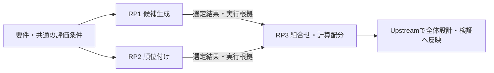

# 既存要件・設計の見直しとDesign Researchの使い方

[概要](README.md) · [使い方](usage.md) · [導入手順](installation.md) · [Design Research](../design-research/README.md)

既存の要件が今も必要か、評価方法が適切か、より精度を出せる実現方式があるかを、目的と根拠から見直します。
Workbench 2.0.6は、新規設計や実現方式を変えるTo-Be設計で、該当テーマのDesign Researchを実行してから設計を確定します。
標準的な実装は根拠付きで`standard`に分類します。As-Isの整理や単純な文書修正に全体の再研究を一律に要求するものではありません。
Codexには目的を短く伝えれば、Skillが研究の範囲と実行方法を選びます。

ここで扱う「精度」には、要件・設計判断の確かさと、検索・抽出・分類・推論などの処理結果の精度があります。
いずれも対象と確認方法を明らかにします。
要件の妥当性は関係者の目的や合意から確認し、技術的な実現性・方式の効果・評価方法は研究や実測で確かめます。

## 成果物の保存先と確認先

対象プロジェクトで通常読むのは次の資料です。実際の`docs_dir`・slug・run IDを使って確認します。

| 確認したいこと | 正本 | 主な内容 |
|---|---|---|
| 何を作る・維持するか | `docs/upstream/requirements.md` | 目的・利用者・範囲、機能・品質・制約、現状と期待、不明点 |
| どう実現するか | `docs/upstream/design.md` | 構成・動作・データ・API・運用、選定理由と変更影響 |
| どこまで確認できたか | `docs/upstream/verification.md` | 受入条件、確認方法、実際の結果、未実行、証拠 |
| 研究・実測から何が分かったか | `docs/design-research/<slug>/report.md` | 結論、比較、検証、変更前後、残る確認。実行した場合のみ |

研究の結論は設計の選定理由へ、評価条件と実際の結果は検証へ戻します。全文の複製や個別のdecision/fix報告は作りません。
最新のreport.mdは実行前・停止時にも状態を表示します。仕様から長期参照する場合は`runs/<run-id>/reports/report.md`を使います。
旧形式は任意の移行まで既存の正本を案内します。[配置・移行](usage.md#成果物の保存先と確認先)
Skillの最終回答は結論と該当する正本へのリンクを中心にし、判断待ち・未実行を明示します。内部記録は、結果や停止理由を調べる必要がある場合だけ補足します。

## 最初に入口を選ぶ

| やりたいこと | Codexへの入口 | Design Researchを使う場面 |
|---|---|---|
| 既存仕様が不明、実装と仕様の違いを整理したい | `$upstream-existing` → `$upstream-check` | バックエンドの実測が必要なら`audit` |
| 要件を維持・変更・廃止する判断をしたい | `$upstream-check` → `$upstream-change` | 技術的な実現性や制約の比較には`research` |
| 精度要件・受入条件・評価方法を見直したい | `$upstream-check` → `$upstream-change` | 評価方法自体を比較するなら`research` |
| 検索・抽出・分類・推論などの精度を改善したい | `$upstream-check` → `$upstream-change` | 現行方式と候補の効果を比較するなら`research` |
| 外部挙動を保って内部設計を改善したい | `$upstream-refactor` | 実現方式を変えるなら該当テーマの`research` |
| 不具合の原因・修正方針を確認したい | `$upstream-bug` | バックエンドの再現・検証は`audit`、方式選択は`research` |
| データ・モデル・環境の変化で過去判断を再評価したい | `$upstream-check` → `$upstream-change`または`$upstream-refactor` | 完了した研究の見直しには`reassess` |

矢印は別の作業へ進む順序です。各Skillは固定のモードを持ち、次の入口が必要なら理由と対象を示します。
APIの形式が同じでも、処理結果・受入条件・品質契約を変える場合は`change`として整理します。
`refactor`では維持する外部挙動・データ・互換性を明示します。

## 共通の進め方

1. **現状と見直し理由を確認する**。コード・稼働版・既存資料・過去判断を読み、観測した現状、合意済み要求、改善提案を分けます。
2. **判断する問いを絞る**。目的、関連する要件・設計ID、変更できる範囲、維持する契約、未確認事項を整理します。
3. **評価条件を揃える**。対象入力、評価データ、正解の判定方法、指標・合格条件、失敗ケース、性能・費用・運用の制約を確認します。分からない数値は未定のまま記録します。
4. **研究計画を固定して実行する**。要件の分類とテーマ、入出力・評価条件・依存・予算・統合条件を整理します。必要な要件レビュー・明示承認を済ませ、実際のDesign Research Skillとハーネスを使います。1テーマにつき基準案を含む約5候補が目安です。
5. **結果を変更案へ戻す**。比較結果と根拠を要約し、要件・受入条件、設計判断、検証計画、変更履歴へ結び付けます。
6. **変更内容を再レビューする**。提案と採用承認を分け、`$upstream-review`で対象を固定し、明示承認後に`$upstream-approve`、構造検査・対応表生成・gateへ進みます。

## 新規機能をストーリーから設計する

```text
$upstream-new 文書を検索し、根拠を見ながら回答を確認できるアプリを作りたい。
```

利用者が何を判断したいか、誤った根拠や回答で何が困るかを先に確認します。
ストーリーと懸念を、検索・根拠確認・失敗時の戻り方などのユースケースへ具体化し、要件と受入条件を整理します。
検索・順位付け・回答生成など、方式によって要件達成が変わる問いを研究テーマに分けます。
研究結果を組み合わせて全体設計・技術選定・検証計画を作り、レビューと明示承認へ進みます。

画面例を含める場合は、実際に利用できるUI/UX Skillを適用します。
[ストーリーから設計する手順](usage.md#ストーリーから研究を経て設計する)で、懸念の確認、図の読み方、画面の状態と確認範囲を扱っています。

## 複数のコアロジックを研究テーマに分ける

次は検索品質と応答時間を改善する例です。具体的な方式や数値を選定済みという意味ではありません。

```text
$upstream-change 検索の取りこぼしと上位結果の質を改善したい。待ち時間の制約も含めて設計を見直して。
```

| 研究テーマ | 判断する問い | 固定する条件・確認する指標 |
|---|---|---|
| RP1 候補生成 | どの方式なら関連情報の候補漏れを減らせるか | 入力・フィルター、候補段階のRecall、資源条件 |
| RP2 順位付け | どの方式なら関連結果を上位に出せるか | 固定候補セット、順位指標、失敗条件、追加処理時間 |
| RP3 組合せ・計算配分 | 選んだ候補生成と順位付けが全体制約を満たすか | 全体の品質・応答時間・メモリ、接続互換性 |



この図は研究の依存関係です。RP1・RP2は共有条件と入力を固定できる場合に独立して探索できます。
選定した方式同士の組合せ確認は、両方の実際の結果を受け取ってから行います。
アプリ実行時の「候補生成 → 順位付け」と、研究を進められる順序は区別します。

計画は`.specify/workbench/research-plan.json`、人向けの要点は`requirements.md`に記載します。
全要件を`research`・`standard`・`clarify`・`out_of_scope`に分類し、テーマと理由、固定する入力・出力・評価データ・指標、
依存、資源・予算、統合担当と全体の受入条件を対応させます。
5候補の目安はテーマごとです。テーマを5個作る指示ではなく、切り分け実験も別の候補として数えません。

現在のCLIは計画の検査と依存順の表示までを扱い、並列プロセスの起動やコピー作成・資材回収を自動化しません。
同じプロジェクトでは既存のロックに従い直列実行します。テーマ数に比例して予算を自動で増やすこともありません。
計画だけの依頼は計画で止め、研究を依頼された場合は実行できたテーマと未実行のテーマを区別して返します。

個別報告から、採用候補、入力・出力契約、根拠、費用、失敗条件、未確認を回収します。
局所的な最高精度を組み合わせるだけで済ませず、接続互換性と全体の品質・速度・資源を確認します。
組合せ検証が未実行なら`planned`として検証計画に残し、個別研究の完了だけで全体要件を満たしたとは扱いません。

## 1. 既存仕様が不明、実装と仕様が食い違う

仕様書が不足していたり、コードからしか動作が分からなかったり、資料と実装が一致しなかったりする場合に使います。
最初に対象版と正本を確認し、現状の不具合まで正しい仕様として追認しないよう、As-Is・合意済み仕様・To-Beを分けます。

```text
$upstream-existing 保存処理の実装と仕様の違いを整理して。
現状、合意済み仕様、改善案を分けて。コードは変更しないで。
```

現状調査のベースラインと仕様との差をまとめ、関連する要件・検証計画へ反映します。
文書だけで確認できればDesign Researchは不要です。実測した場合は`report.md`と実行根拠を参照します。
仕様として合意する事項と、まだ確認が必要な事項を分けて提示できたところで、`$upstream-check`による内容の点検へ進みます。

## 2. 要件を残す・変更する・廃止する判断

目的や利用条件が変わった場合、使われていない機能がある場合、制約や費用に見合わない要求がある場合に使います。
元の目的、関係者のニーズ、契約上の義務、変更の影響を確認します。必要性や優先度を技術文献だけで確定しません。

```text
$upstream-check 夜間の全件再計算は今も必要か、維持・変更・廃止の案を整理して。
業務上の理由が確認できない部分は、確認事項として残して。
```

目的と要件の対応、判断の根拠、変更する受入条件、影響範囲、確認質問をまとめます。
技術的な不確実性がなければ文書と関係者の確認で進めます。研究した場合は条件付き推奨と未確認事項を残します。
採否を確認できる変更案ができたら`$upstream-change`へ進み、廃止する要件もID・履歴を残して追跡します。

## 3. 精度要件・評価方法が曖昧

「高精度」「適切な回答」などの要求を検証できない場合、評価データが偏っている場合、良否の判定が担当者によって変わる場合に使います。
何を正解とするか、誤りの影響、利用者が必要とする水準、評価用入力の代表性を確認します。

```text
$upstream-check 文書抽出の「高精度」を検証できる要件と評価方法にしたい。
目標値が未定なら、決めるための根拠と確認事項を示して。
```

評価方法の比較、指標の選定理由、評価データ・版、正解判定をまとめ、受入条件と検証計画の案を作ります。
方式の改善と評価方法の変更を区別し、同じ条件で比較できる評価案を作ります。
合格値や正解判定の重要な未決定事項が残る場合は、検証可能性を確認できたと主張せず、`$upstream-change`へ渡す確認待ち事項にします。

## 4. 処理結果の精度を改善したい

検索の取りこぼし、抽出・分類の誤り、推論・回答の不正確さなどを改善したい場合に使います。
現行方式の誤りを分類し、比較データ・評価手順と、速度・費用・運用の上限を確認します。

```text
$upstream-change 検索の取りこぼしを減らしたい。
速度・費用の制約を含めて現行方式を比較し、品質要件と設計を見直して。
```

基準値・候補比較・実行結果と条件付き推奨をまとめ、品質要件・設計判断・検証計画へ反映します。
調整に使った入力だけで改善を判断せず、必要な独立評価や反復も検討します。
研究の完了と目標精度の達成は分けます。効果が未確認ならその状態を残し、採用案・不採用案と理由をレビューできたところで終了します。

## 5. 外部挙動を保って内部設計を改善したい

保守の負担、性能・運用上の問題、技術更新を理由に内部設計を見直す場合に使います。
守る挙動・API・保存データ・品質下限と、改善する目的を分けます。技術名そのものを目標にしません。

```text
$upstream-refactor 集計処理の内部設計を見直して。
外部API・出力・保存データ・品質下限を維持し、移行と切り戻しも計画して。
```

維持する契約と比較・採否理由をまとめ、設計変更・移行・切り戻し・回帰検証の計画へ反映します。
標準的な実装や確認済みの小さな内部整理は、既存根拠を示して扱います。実現方式を変えるなら該当テーマを研究します。処理結果や品質契約まで変える必要が分かった場合は、その変更を`$upstream-change`へ渡します。
維持する条件と設計案をレビューできたところで止め、実装は別の依頼で進めます。

## 6. 不具合の原因・修正方針を確認したい

合意済みの期待挙動と実際の結果が違う場合に使います。
症状、期待・実際の結果、対象環境、再現条件、影響、関連要件を整理し、原因候補と確定原因を分けます。

```text
$upstream-bug 二重送信で保存結果が重複する問題を調べ、修正方針と回帰検証を整理して。
テスト用データを使い、アプリの修正はまだ行わないで。
```

不具合の追跡情報、再現結果、関連する要件・設計、修正方針、回帰検証計画をまとめます。
原因と対策が明らかな小さな不具合には、文献調査を一律に要求しません。再現できない場合は未再現として記録します。
`audit`の報告完了は問題の解消を意味しません。根拠と修正案・未確認事項を提示したところで止めます。

## 7. 条件が変わり、過去の設計判断を再評価したい

入力データ、モデル、利用規模、依存ソフトウェア、運用環境が変わった場合に使います。
過去判断の適用条件と見直し条件、現在の目的・品質契約、変更点を確認します。

```text
$upstream-check 入力文書の種類が増えたので、抽出方式の過去判断を再評価して。
以前の判断を残し、新しい条件で維持・変更・保留を判断したい。
```

完了した過去研究と保存版の報告がある場合は`reassess`を使い、新しいslug・runで独立した報告を作ります。
以前の採用案と、少なくとも1案の異なる原理を含めて比較します。
要件変更 → 関連テーマ → 依存テーマ → 統合評価の影響を追い、未変更の知見も適用条件を確認します。
現在は正本要件全体のバイト列を固定するため、古いrunを新しい要件の下で実測したものとして付け替えません。
旧判断との関係と新しい条件での比較をまとめ、設計判断や必要な要件変更・検証計画へ反映します。
異なる条件の古い数値と新しい数値だけで方式の効果を主張しません。現行方式も新しい条件で評価します。
維持・更新・判断保留の理由と、次の入口を提示したところで終了します。

## Design Researchを単独で明示する場合

一つの方式の研究から始めたい場合は、`$design-research`を直接使います。

```text
$design-research このプロジェクトの検索方式を見直して。
```

関連する要件・設計・検証計画があれば、Skillが問いと制約を読み取ります。
一意に選べないIDや過去研究は確認し、資料がない場合はその状態を残します。
方式の比較・PoCと報告を作り、全体設計を整理する必要がある場合はUpstreamへ渡します。
完了した研究の再評価、中断再開、状況確認も同じSkillへ短く依頼できます。

その結果をSpecKit側へ戻す依頼例です。`<slug>`と`<run-id>`は実在する値に置き換えます。

```text
$upstream-change docs/design-research/<slug>/runs/<run-id>/reports/の研究結果を確認して。
適用条件を確認し、関連する要件・設計・検証計画の変更案へ反映して。
```

既存の研究は、問い・対象版・評価条件・根拠が一致するか確認して再利用します。
ターミナルで実行する場合の配置先・引数・実行制限は[Design Researchの使い方](../design-research/usage.md)を参照してください。

## 研究結果を仕様へ戻す

研究の正本は`docs/design-research/<slug>/report.md`です。報告・証拠台帳の有無は実行結果に従い、存在しないファイルへのリンクは作りません。
上流文書には判断に必要な要約と関連ID、run ID、保存版の報告・実行根拠へのリンクを残します。

| 反映先 | 残す内容 |
|---|---|
| 目的・要件・受入条件 | 維持・変更・廃止の提案、品質目標と判定条件、合意が必要な点 |
| 設計判断 | 現行案と候補、共通の比較条件、採否理由、影響、未確認事項、見直し条件 |
| 検証・妥当性確認の計画 | 評価データ・版、指標、正解判定、期待結果、失敗・回帰検証、実施範囲 |
| 変更・不具合の追跡 | 見直し理由、関連ID、影響範囲、旧判断との関係、研究の実行ID・状態 |

要件IDを可能な限り維持し、廃止・置き換えは`retired/supersedes`と履歴で追跡します。
要約と参照は項目の`sources`と通常Markdown本文へ記載します。
参照する外部ファイルの中身は承認ハッシュに含まれないため、採用判断と適用条件を承認対象の文書にも残します。
同じslugのトップレベル報告は更新され得るので、実行ごとの`runs/<run-id>/reports/report.md`と実際の根拠を参照します。

`research_complete`は条件付き提案の完成、`reviewed`は監査報告の完成です。目標精度の達成や採用承認を終了コードから判断しません。
未完了の研究や必須条件の不足は確認待ちとして残し、実行結果だけの追記と仕様の変更を区別します。
変更した要件・設計・根拠は再レビューします。[レビュー・承認の記録](usage.md#レビューと承認を記録する)

## 未導入・旧版・実行不能の場合

Design Researchは別途導入するキットです。[導入・更新手順](../design-research/installation.md)で、実際のSkill配置先を確認します。
ハーネスのない旧版、`doctor`失敗、実行不能では、必要な研究を未実行として記録し、導入・更新や不足する実行条件を案内します。
SpecKit側からDesign Researchを自動インストールする手順は含めていません。
要件・As-Isの整理と確認事項は進められますが、必要な研究が未実行なら方式設計を確定しません。
2.3.1の入口と研究分割を使う場合は、実際の導入版・配置先を確認します。配布スクリプトの版表示だけでは導入済みを証明できません。
組み立てと導入の確認範囲、修正前の停止条件は[検証結果](../design-research/validation.md)を参照してください。

この連携ではDesign Researchの`research/audit`を使います。ローカル実験・テスト用データによる検証・研究報告までを、依頼と既存の許可の範囲で行います。
アプリのコード・本番データの変更や、`run`による修正は別の実装依頼で扱います。
Skillの指示とCLIの構造検査は別です。`check/gate`だけでは研究の実施、結論の妥当性、実測値の真偽を確認できません。
