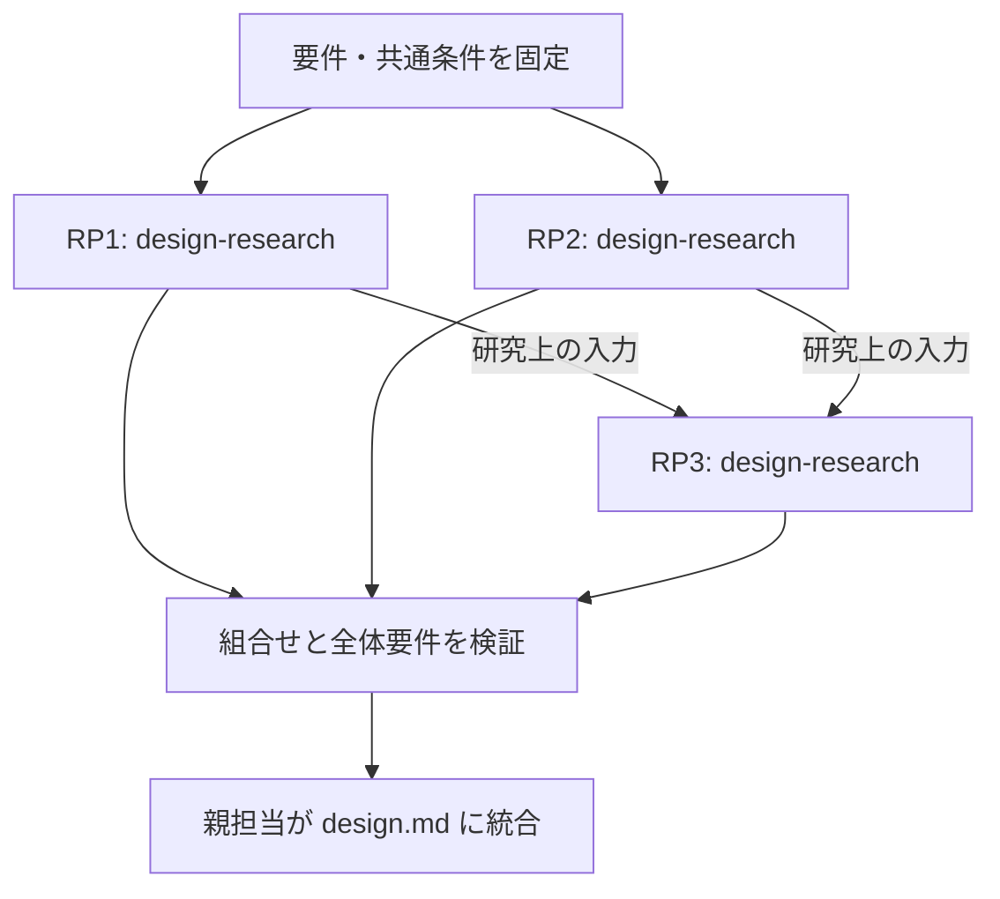

# 要件から切り出したコアロジックの検討計画

これは実行計画です。研究結果・実行済みの証拠ではありません。

## 要件と研究テーマ

| テーマ | 対応要件 | 判断する問い | 比較目安 | 前提となる研究 |
|---|---|---|---|---|
| RP1: 候補抽出の漏れを減らす | SYS-R1 | 候補抽出の漏れを減らすには、どの方式が制約内で有効か。 | 5 | なし |
| RP2: 検索順位を改善する | SYS-R1 | 検索順位を改善するには、どの方式が制約内で有効か。 | 5 | なし |
| RP3: 組合せの速度を改善する | SYS-R2 | 組合せの速度を改善するには、どの方式が制約内で有効か。 | 5 | RP1, RP2 |

## 調査・実験の順序

**図の読み方：** 矢印は研究上の依存関係です。アプリ実行時の処理順とは別です。各研究の結果を統合してから全体設計へ戻します。

図が表示されない場合は、固定要件→各研究テーマ（前提研究を先に実施）→統合検証→全体設計の順です。

## 実行バッチ案

1. RP1, RP2
2. RP3

同じプロジェクトでは既存ロックを維持して直列化します。並列候補は独立コピーで、親が実環境・予算・先行結果を確認した場合だけ実行します。
このCLIはプロセスを起動せず、予約予算は実際の消費を計測するカウンターではありません。

## 統合で確認すること

現行全体と選定部品の組合せを比較する。

検索結果の品質と最終応答時間を同時に確認する。

GPU・メモリ・利用コストの総量を確認する。

部分最適を採用せず、衝突時は関連テーマへ差し戻す。

## 研究しない要件と未解決の懸念

- SYS-R3 / standard: 監査ログは既存の確定仕様を使う。
