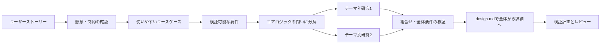

# 研究を根拠にした段階的な設計

## 必須の順序



**図の読み方：** 機能名からすぐ技術構成へ飛ばず、利用者の目的と不安を要件にした後で方式を選ぶ。研究で成立しない条件が見つかった場合は要件案へ戻り、ユーザーの確認を取る。
図が表示されない場合の流れは、ストーリー→懸念の確認→ユースケース→要件→方式研究→設計→検証計画。

新規設計または実現方式を変えるTo-Be設計では、**design-researchを実行してから設計を確定することが必須**。
researchの文章を似せて書く、Skillを読んだだけで済ませる、終了コードだけを引用する、方式を先に決めて後で理由を付けることは禁止。
既存資料のAs-Is転記や誤字修正に全体再研究を強制しない。変更される設計判断に対象を絞る。
既存の検討を引き継ぐ場合はreassess、同じ条件で中断した実行を続ける場合はresumeを使う。

## ユーザーストーリーから要件を作る

既存のストーリー・会話・制約を先に読む。既に回答済みの質問を繰り返さない。
不明な懸念のうち、仕様・業務価値・使い勝手を変えるものだけを優先して確認する。
例：最も避けたい誤操作は何か、途中で戻る/中断するか、結果を信頼できる判断材料は何か、誰と引き継ぐか。
回答がない箇所は仮説または未決定として分け、沈黙を承認としない。高影響の未解決事項は設計確定を止める。

ユースケースには利用者・目的・きっかけ・前提・開始状態・主要手順・各手順のフィードバック・成功条件を含める。
空状態、入力ミス、通信失敗、重複、権限不足、中断/再開/取り消し、入力保持、アクセシビリティも該当範囲で書く。
「ボタンを置く」ではなく「迷わず対象を選び、安全に完了を判断できる」体験を考える。
良い使用感を主張する前に、成功率・迷った箇所・操作のやり直し・時間などの評価方法と未測定を区別する。

`ストーリーID → ユースケースID → 要件ID → 設計ID → 検証ID`を本文の対応表と既存のupstreamメタデータへ結び付ける。
新しいメタデータtypeを勝手に導入しない。ユースケースIDは本文の識別子として持ち、story/requirementへの参照で表す。

## design-researchへの引き渡し

先にRESEARCH_WORKSTREAMS.mdを読み、要件→必要能力→コアロジックの問いを切り出す。
システム全体一括でなく、固定した研究テーマ単位で以下を実行する。共有条件を固定できる独立テーマだけ並列候補にする。

要件に必要なレビュー・承認を済ませてから方式研究へ進む。承認メタデータを含め正本の内容が変わった場合も、古いスナップショットのまま設計確定しない。

実際のSkillとgan-harness.shを発見して読む。discoveryディレクトリはユーザー/プロジェクトの既存設定に従う。
未導入・実行不能なら理由と導入方法を報告し、要件/As-Isの作業は進めても方式設計の確定は停止する。
Skillを勝手にインストールしたり、上流作業をアプリ実装の許可へ広げたりしない。

```bash
bash <actual-skill>/scripts/gan-harness.sh research \
  --project <project> --slug <new-topic> \
  --requirements <canonical-requirements-relative-path> \
  --workstream-plan .specify/workbench/research-plan.json --workstream-id <task-id> \
  --reader-friendly --report-profile proposed-method --target-methods 5 \
  --brief "対象ユースケース・要件ID・懸念・制約・方式の判断事項" --allow-network
```

単なる既存方式の選定なら`--report-profile comparison`を使ってよい。新規性を捏造せず、具体的な改良案を詳述する場合にproposed-methodを使う。研究の実行・5候補を目安にした比較・図解はどちらでも必要。

ネットワークは既存許可の範囲だけ。機密コードや内部要件を検索クエリへ送らない。
ベースラインと強い既存法を含む約5候補を調べ、同じ評価条件で比較する。数合わせより原理の違いと適用可能性を重視する。
原典の該当箇所、作用機序、実装/運用負担、限界、反証実験を確認する。未実行の実験は計画として残す。
今回の要件ファイルは実行入力としてハッシュ固定される。変更後の古い研究をそのまま設計根拠にしない。

## design.mdへの反映

目的・利用例・用語 → 外部との境界/全体アーキテクチャ → 主要コンポーネントの拡大 → 代表処理の順序 → データ/API/失敗時の振る舞い → 技術選定 → 検証/限界。
全体図と詳細図の部品名・IDを揃え、どの箱を拡大したか明示する。矢印にはデータ/処理の意味を書く。
図の前に問い、後に読み方を添える。図が読めなくても要点が分かる説明を付ける。
フレームワークは層、名称、役割、版/確認状態、採用理由、代替案、根拠の列で示す。
実装済み・選定案・未確認を分ける。版は実manifestまたは公式資料で確認し、未確認の最新版を作らない。
単なる製品名一覧、過剰な細分化、採用を前提とする複雑化を避ける。

## UI/UXスキルの必須利用

画面例を作るときは、実在する `ooui-design` 等のUI/UX Skillを読む/適用し、対象・属性・操作・状態・導線を整理する。
利用可能なProduct Design/Build Web Apps等が適合する場合は、そのSkillの設計手順に従ってモックを作る。
静止画と動作するプロトタイプを区別する。主要、空、読み込み、成功、失敗、中断復帰など必要な状態を扱う。
稼働する画面のレビューが対象なら適切なUI/UXレビューSkillを使い、実際の画像と操作を確認する。
設計だけの依頼では本体アプリ実装やux-gan-harness runを始めない。UI/UX Skillがなければ画面例の完成判定を保留する。
利用したSkill、適用した原則、生成物、確認方法、未確認を記録する。スキル名を記載しただけで実行を証明できるとは言わない。

## 機械検査への接続

新規/変更設計はRESEARCH_WORKSTREAMS.mdのv2 bindingを使い、テーマ別研究と統合結果を対応させる。
旧v1 bindingは互換性のため読み取れるが、新しい研究分解の代わりに使わない。
各runの実行状態、同じrunのアーカイブreport、正本要件と研究計画のSHA-256を確認する。
複数run→一つの設計判断の対応を許可し、標準的な実装は計画上のstandard分類と既存根拠で説明する。
未完了テーマや統合の不明点を隠さず、draft/readyと実際の検証成功を区別する。
