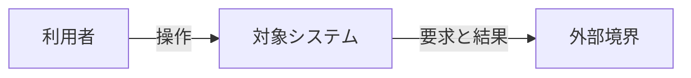
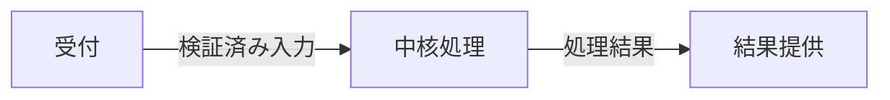
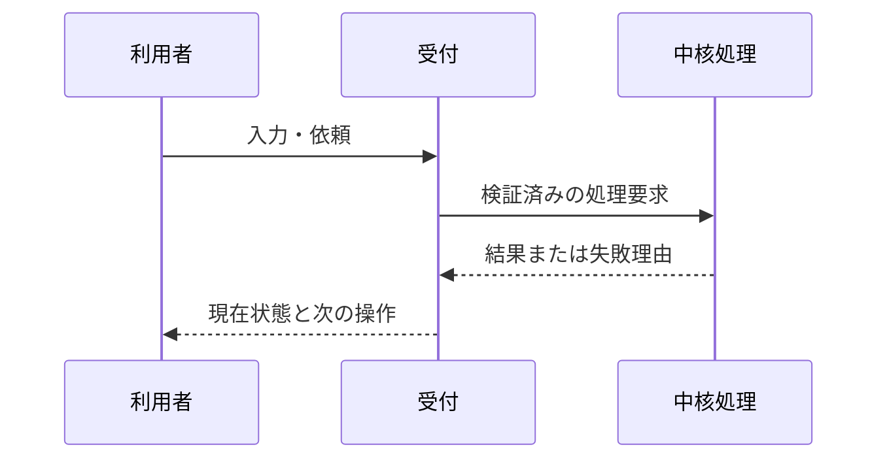

# @SYSTEM@ 設計

<!-- upstream-design-contract:v2 -->

## 共通条件

TBD: 対象読者、対象版、制約、設計案/実装済み/未確認の区別を記載する。
この文書はrequirements.mdと実行済みdesign-researchの判断に基づく。共通条件の変更時は再レビューする。

<!-- upstream:section overview -->
## 目的・利用例と現時点の結論

TBD: 誰の何の困りごとを解決するか、代表ユースケース、採用候補、未確認事項を説明する。

### 読み方と用語

TBD: 本文は全体図から重要部品を拡大し、代表処理へ進む。固有名詞・略語を初出で定義する。
<!-- /upstream:section -->

<!-- upstream:section content -->
## 要件から切り出したコアロジックと研究計画

TBD: 必要能力から、不確実性のある検索・順位付け・推論・判断等を研究テーマへ切り出す。
TBD: research / standard / clarify / out_of_scope の分類根拠、共有入力/評価契約、依存と並列可否を説明する。
TBD: RESEARCH_WORKSTREAMS.mdに従い、研究上の依存を図で示す。アプリの処理順とは別の図にする。

| 要件ID・達成したいこと | コアロジックの問い・テーマID | 指標・制約 | 先行研究テーマ・並列条件 | 研究結果・対応する部品 |
|---|---|---|---|---|
| TBD | TBD | TBD | TBD | TBD |

## テーマ別の方式検討の根拠と要件への対応

TBD: 実際の研究run ID、実行コマンド、アーカイブreport.md、各テーマで約5候補の比較、選定/不採用理由、適用条件をまとめる。
TBD: RESEARCH_WORKSTREAMS.mdのv2 bindingに従い、実SHA-256と設計IDを含むdesign-research JSONブロックを記載する。

| ユースケース・懸念 | 要件ID | 設計ID | 研究の候補・根拠 | 検証ID |
|---|---|---|---|---|
| TBD | TBD | TBD | TBD | TBD |

## 全体アーキテクチャとシステム境界

TBD: 図1で利用者・対象システム・外部サービスの責任分界を説明する。以下は配置用の雛形で、対象固有の構成へ置き換える。

**図1の読み方：** TBD: 利用者の1つの操作がどこまで本システムの責任で処理されるかを説明する。

## 主要コンポーネントのアーキテクチャ

TBD: 図1のSystemを図2で拡大する。各要素の責任、入出力、状態、失敗時の扱いを説明する。

**図2の読み方：** TBD: 図1との対応と、提案した変更箇所を明示する。

## コアロジックごとの手法・入出力と選定理由

TBD: 各研究テーマの提案手法を、直感→処理/数式→実装条件→全体図の該当部品、の順で説明する。
TBD: 全体図の部品を拡大した詳細図とテーマ固有reportへの参照を付ける。原典/実測/仮説を区別する。

## 個別手法の組合せと全体要件の検証

TBD: 入出力の互換性、精度と速度、資源の総量、権限やデータ鮮度への影響を確認する。
TBD: 個別最良案を単純に足し合わせず、基準となるシステム全体との比較と採用組合せを説明する。
TBD: 統合結果はplanned/verified/inconclusiveを分け、検証ID・資材・未確認を明記する。

## 代表ユースケースの処理と状態遷移

TBD: 具体的な入力例を使い、成功経路に加え、該当する入力保持/取り消し/再試行/復帰を説明する。

**図3の読み方：** TBD: どこで状態が変わり、利用者が何を確認できるかを書く。

## フレームワーク・ライブラリと選定理由

| 層・部品 | 名称と役割 | 版・確認状態 | 採用理由と代替 | 実manifest/公式根拠 |
|---|---|---|---|---|
| TBD | TBD | TBD | TBD | TBD |

TBD: ランタイム、主要フレームワーク、データ保存、推論/学習、外部サービスの該当範囲を明記する。新しい依存を自動追加しない。

## UI/UXによる画面例と操作の確認

TBD: 使用した実Skill、対象/操作/状態、代表画面、導線図、適用した原則、検証の範囲を記載する。
画面を作らない場合は理由を記載し、bindingのuiux.applicable=falseと整合させる。

## 実装上の詳細・失敗時の設計

TBD: データ構造、インターフェース、必要な数式/擬似コード、計算/運用コスト、互換性、監視、復旧を説明する。

## 限界・未検証事項と見直す条件

TBD: 研究で不明だった条件、要件変更時の再検討事項、verification.mdの受入条件を示す。
<!-- /upstream:section -->

項目はそれぞれ固有の節内へ追記する。本文とメタデータの意味を一致させ、テンプレート図を完成したアーキテクチャとして扱わない。
