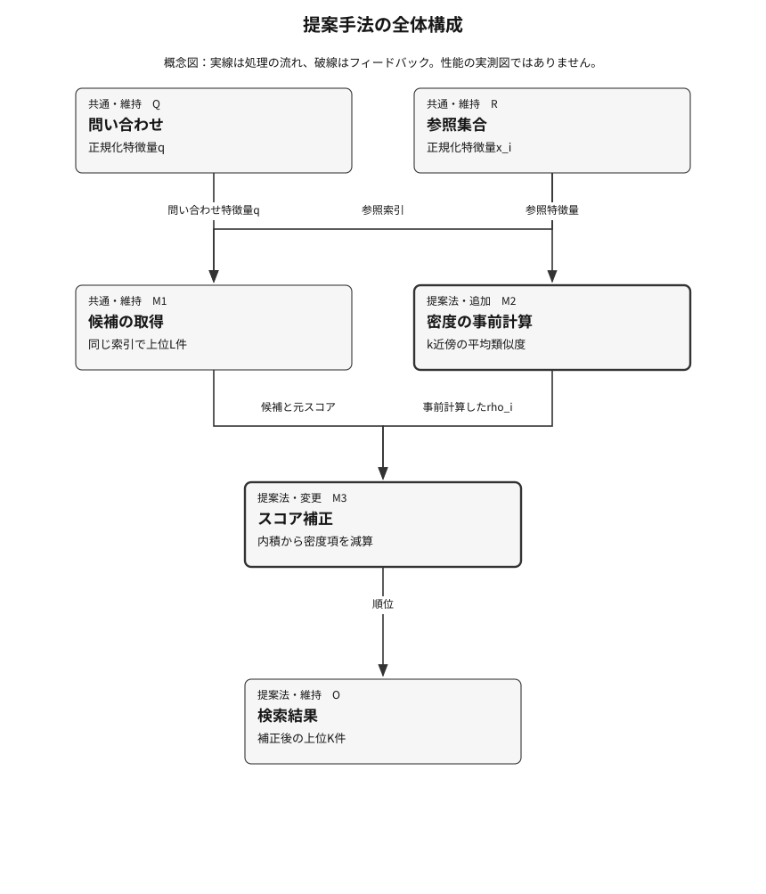
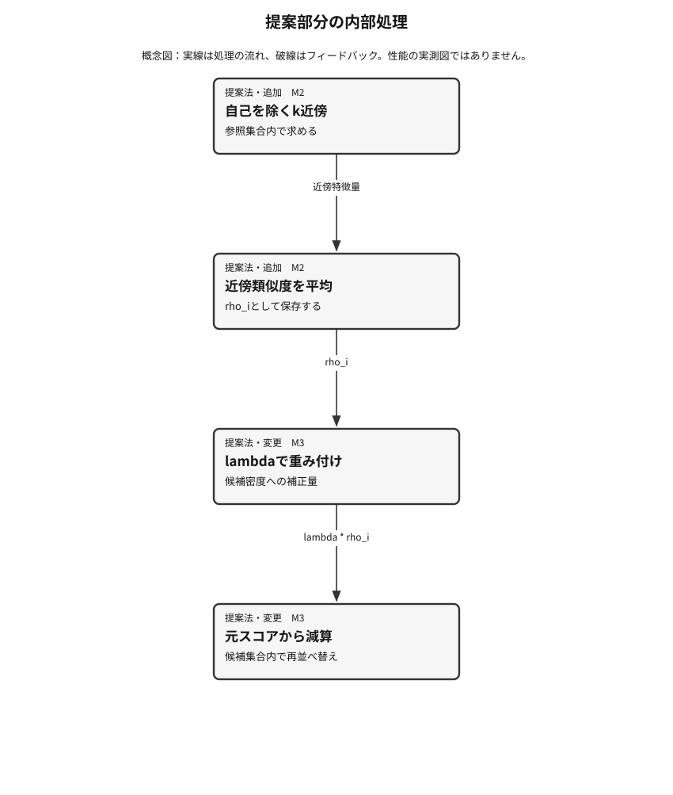
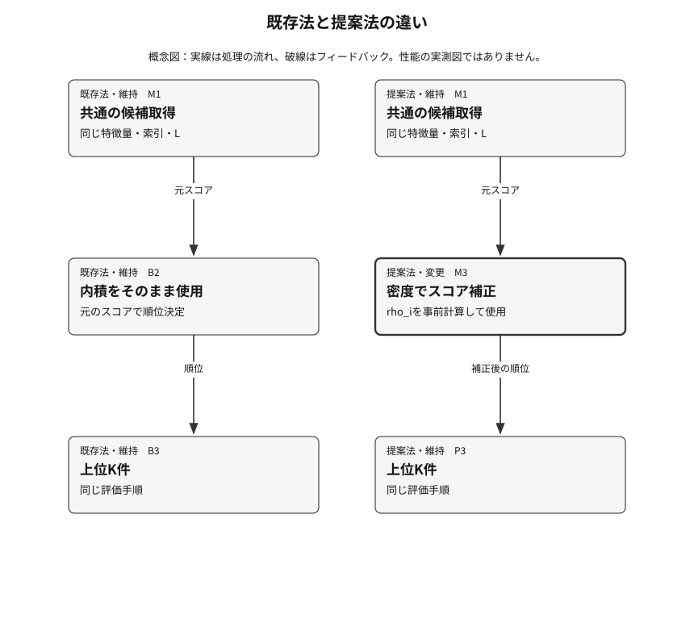

# 提案手法章の出力例

> **合成入力による表示確認用です。資料と実験は架空であり、実証済みの研究ではありません。**


## 提案手法

**説明対象：P3 — 候補密度を考慮した再ランキング**

設計記述と図の構造チェック済み。新規性・有効性・比較上の優越を認定するものではありません。

【合成入力・表示確認用】この章に用いる資料と実験記録は架空のテスト用データである。実験は未測定であり、図も性能の証拠ではない。

### ねらいと直感

この架空例では、検索モデルを大型化せず、検索結果の並べ替え方だけを変える。多くの入力に似てしまう候補に小さな罰則を与えることで、問い合わせに固有の候補を浮かび上がらせる、という考え方である。

全体の多くの入力に似てしまう候補は、真に近い候補より過剰に上位へ現れる可能性がある。局所密度による補正がその偏りを抑える、という未検証の仮説を置く。

まず従来と同じ内積検索で候補を集める。次に候補ごとの近傍類似度の平均を密度指標として引き、候補の順位を補正する。検索範囲や特徴抽出器を変えずに後処理だけを変更することで、特徴学習の効果とは切り分けて検証できる。ただし、密度が高い領域に本当に正解が多ければ、必要な候補まで下げてしまう可能性がある。

### 全体像と具体例

たとえば、様々な問い合わせに毎回現れる候補と、その問い合わせにだけ近い候補があるとする。元の内積が似ていても、前者の局所密度が高いときは補正後に順位が下がる。この例は動作の説明であり、具体的な精度改善を観測した例ではない。



**図1．提案手法の全体構成**　従来の候補取得を保ち、密度の事前計算とスコア補正を追加する。破線は使わず、実行時に受け渡す情報を実線で示す。

左側の問い合わせの流れと、右側の参照集合の準備を区別する。提案部分はM2とM3であり、M1を変えないことが比較条件になる。

[図1の編集用定義](method-figures/8a4ff7971ce7a35113edc9506c1afc84a9c7e659f010d5c295b9db38692f0a5d/F1.json)

### 構成要素の詳細

#### M1：共通の候補取得

**入力：** 問い合わせ特徴量qと参照特徴量x\_i  
**出力：** 内積の大きい上位L件の集合C\(q\)

従来と同じ索引、同じ特徴量、同じ探索設定で候補を取得する。

**なぜ必要か：** 検索範囲の変更を混ぜず、後処理の効果に比較を限定する。

**既存法との差分：** この段階は変更しない。

**追加コスト：** 既存検索と共通。

#### M2：候補密度の推定

**入力：** 参照集合の正規化特徴量と近傍数k  
**出力：** 各候補の近傍類似度の平均rho\_i

自分自身を除いたk近傍を集め、内積の平均を計算する。密度は参照集合から事前計算し、問い合わせ間で再利用する。

**なぜ必要か：** 多くの参照項目に似る候補を、問い合わせからの類似性とは別の指標で捉える。

**既存法との差分：** 従来は保持していなかった密度の値を追加する。

**追加コスト：** 参照集合の近傍探索と、項目数に比例するスカラー値の保存が増える。

#### M3：スコア補正と順位決定

**入力：** 候補集合C\(q\)、元の内積、rho\_i、補正係数lambda  
**出力：** 補正スコアが大きい上位K件

候補ごとの内積からlambda倍の密度を引き、補正スコアで順位を決める。lambdaがゼロなら元の順位に戻る。

**なぜ必要か：** 元の類似度を保持しつつ、頻出候補への偏りを相対的に弱める、という仮説に対応する。

**既存法との差分：** 元の内積のみで並べ替えする処理を、密度補正後のスコアによる並べ替えに変える。

**追加コスト：** 上位L候補の補正と並べ替えが増える。問い合わせごとの全件近傍探索は行わない。



**図2．提案部分の内部処理**　候補の密度を準備する処理と、問い合わせ時の減算・並べ替えを分けて拡大した概念図。

学習し直すのではなく、参照集合の密度だけを事前に計算する。補正係数はテスト結果を見ながら選ばず、検証集合で選ぶ。

[図2の編集用定義](method-figures/8a4ff7971ce7a35113edc9506c1afc84a9c7e659f010d5c295b9db38692f0a5d/F2.json)

### 記号・定式化とアルゴリズム

| 記号 | 意味 | 型・次元・範囲 |
|---|---|---|
| q, x\_i | 問い合わせ・候補の正規化特徴量 | R^d、ノルム1 |
| k, N\_k\(i\) | 近傍数と自己を除く近傍集合 | kは1以上、参照件数未満 |
| rho\_i | 近傍との平均類似度 | 実数スカラー |
| lambda | 検証集合で選ぶ補正係数 | 0以上の実数 |
| L, C\(q\), K | 初期候補数、候補集合、出力件数 | 1 &lt;= K &lt;= L |

```math
s(q,x_i) = q^T x_i
rho_i = (1/k) sum_{j in N_k(i)} x_i^T x_j
s_corrected(q,x_i) = s(q,x_i) - lambda * rho_i
output = topK_{i in C(q)} s_corrected(q,x_i)
```

第一式は元の類似度である。第二式は候補周辺の密度を表す。第三式で密度の高い候補に罰則を与え、第四式で補正後の順位を返す。係数ゼロで既存法に戻るため、対照条件を明確にできる。

**擬似コード**

```text
# Preparation: use the reference corpus, not test-label feedback
for each corpus item i:
    rho[i] = mean(inner_product(x[i], x[j]) for j in neighbors(i, k))
# Query processing
q = normalize(encode(query))
candidates = retrieve_by_inner_product(q, limit=L)
for i in candidates:
    score[i] = inner_product(q, x[i]) - lambda_ * rho[i]
return top_k(candidates, score, K)
```

### 学習・準備時と推論・実行時

**学習・準備時：** 特徴抽出器は固定する。参照集合から候補密度を事前計算し、補正係数と近傍数は検証集合だけで選ぶ。

**推論・実行時：** 問い合わせの特徴量で上位L件を検索し、保存済みの密度でスコアを補正して、上位K件を返す。

### 既存法との差分とトレードオフ

| 観点 | 既存法 | 提案法 | 代償・成立条件 |
|---|---|---|---|
| 順位を決めるスコア | 内積のみ | 内積から候補密度を減算 | 密度と正解頻度が一致する領域では過補正に注意する。 |



**図3．既存法と提案法の違い**　同じ特徴量と候補集合に対し、既存法は内積をそのまま使い、提案法だけが密度補正を加える。

両列の最初の条件は揃える。提案法の実験には係数ゼロの対照も入れ、追加容量や探索予算だけでは説明できないかを調べる。

[図3の編集用定義](method-figures/8a4ff7971ce7a35113edc9506c1afc84a9c7e659f010d5c295b9db38692f0a5d/F3.json)

### 先行研究からの導入と独自部分

近傍分布による相対化という原理を、学習済みモデルの再学習ではなく検索結果の後処理へ移す。原典との照合はこの架空例では実施していない。

密度補正そのものの新規性は主張しない。この例は、検索処理のどこを変更し何を固定するかを説明するための架空設計であり、実際の提案では最も近い既存法との同等性を調べる必要がある。

**新規性の記録：** unverified（自動認定ではありません）

- S1：架空の一次資料1（構造テスト用・実在しません）。確認箇所：Section 3 and 4; Fig 2。出典の詳細は主張・根拠の台帳を参照。

### 実装への組込みと計算負担

既存の候補取得APIと出力形式は維持し、順位決定の直前に補正関数を追加する。候補ごとの密度は索引と同じ版で保存し、索引更新時に再計算する。

問い合わせ時には候補数Lに比例する減算と再並べ替えが増える。事前の近傍探索と密度の保存には別の計算・記憶コストが必要である。実測値は存在しない。

### なぜこの案を詳しく検討するか

この案を説明対象にする理由は、特徴抽出器を固定して補正だけを切り替えられ、最小の対照実験で機序を調べられるためである。実験結果から優位性を確認したという意味ではない。

これは説明する設計の暫定選定であり、実証済みの最良手法の選定ではない。比較で不利益が出れば既存法を維持する。

比較の目安は全5手法。現在の比較はベースライン1＋提案候補4。アブレーションを数合わせに使いません。

### 成立条件・反論と設計の改訂

**成立条件**

- 初期候補集合には評価したい正解が十分含まれる。
- 参照集合の密度が索引更新後も対応している。

**主要な反論**

- 改善は密度補正ではなく、補正係数の探索予算が増えたためではないか。

**反論を受けた改訂**

- 調整予算を一致させ、係数ゼロと別の単純な再並べ替えも対照に含める。

**失敗すると予想される条件：** 最初の候補取得で正解が欠落した場合、再ランキングでは回復できない。また、密集領域に正解が集中する入力では補正が不利益になる可能性がある。

### 仮説と検証実験の対応

| 仮説 | 対象 | 実験 | 競合する説明 | 棄却・修正する条件 |
|---|---|---|---|---|
| 候補密度の補正が頻出候補への偏りを抑える。 | M2, M3 | E1：未測定（計画） | 追加の調整予算や一般的な再並べ替えの効果だけで説明できる。 | 同予算の単純な再並べ替えと差がなく、頻出候補条件でも予測した傾向が見られなければ機序の説明を見直す。 |

図はこの設計の説明用です。結果の主張は後続の実験記録と結び付け、未実験の利点は仮説として扱います。

